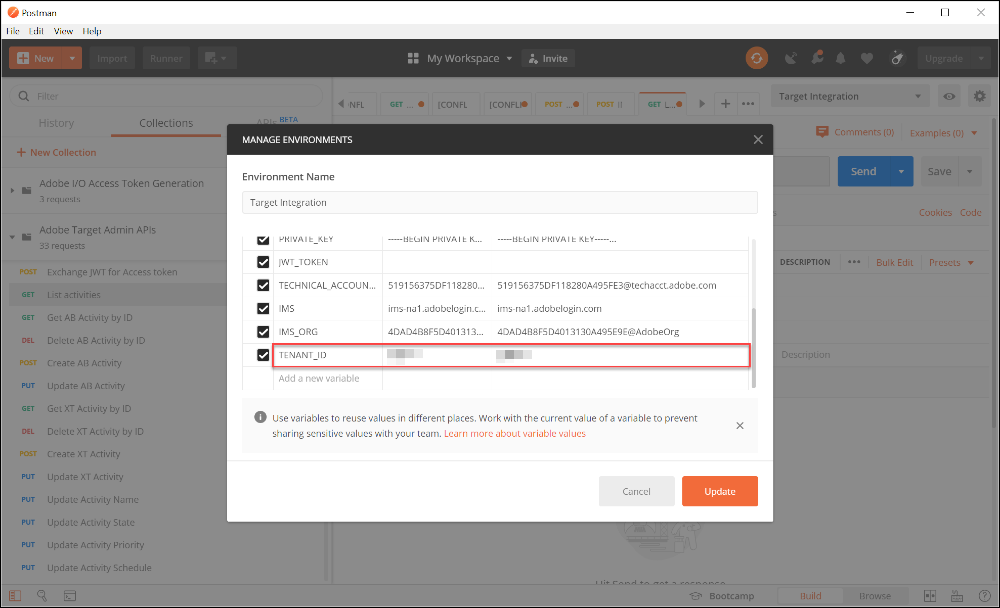

# 인증 구성 [!DNL Adobe Target] API

다음 [!DNL Adobe Target] 다음을 포함한 관리 API [!DNL Recommendations Admin] API는 인증된 사용자만 액세스하는 데 사용할 수 있도록 인증을 통해 보호됩니다 [!DNL Adobe Target]. 사용 [Adobe Developer 콘솔](https://developer.adobe.com/console/home) 모든 사용자에 대해 이 인증을 관리하려면 [!DNL Adobe Experience Cloud solutions], 포함 [!DNL Adobe Target].

>[!IMPORTANT]
>
>이 문서에 설명된 서비스 계정(JWT) 자격 증명은 새 OAuth 서버 간 자격 증명을 위해 더 이상 사용되지 않습니다.
>
>서비스 계정(JWT) 자격 증명은 2025년 1월 1일까지 계속 작동합니다. 2025년 1월 1일 이전에 애플리케이션 또는 통합을 마이그레이션하여 새로운 OAuth 서버 간 자격 증명을 사용해야 합니다.
>
>통합 마이그레이션에 대한 자세한 내용과 단계별 지침은 다음을 참조하십시오. [JWT(서비스 계정) 자격 증명에서 OAuth 서버 간 자격 증명으로 마이그레이션](https://developer.adobe.com/developer-console/docs/guides/authentication/ServerToServerAuthentication/migration/){target=_blank} 다음에서 *개발자 콘솔* 설명서를 참조하십시오.
>
>새 OAuth 자격 증명을 설정하는 방법에 대해서는 을 참조하십시오. [OAuth 서버 간 자격 증명 구현](https://developer.adobe.com/developer-console/docs/guides/authentication/ServerToServerAuthentication/implementation/){target=_blank} 다음에서 *개발자 콘솔* 설명서를 참조하십시오.

다음은 와 성공적으로 상호 작용하는 데 필요한 레거시 JWT 인증 토큰을 생성하는 데 필요한 사전 단계입니다 [!DNL Adobe Target] API:

1. 에서 프로젝트(이전 이름: 통합)를 만듭니다. [!DNL Adobe Developer Console].
1. 프로젝트 세부 정보를 Postman으로 내보냅니다.
1. 전달자 액세스 토큰을 생성합니다.
1. 전달자 액세스 토큰을 테스트합니다.

## 전제 조건

| 리소스 | 세부 사항 |
| --- | --- |
| Postman | 이 단계를 성공적으로 완료하려면 [Postman 앱](https://www.postman.com/downloads/) 운영 체제용. Postman basic은 계정 생성이 무료입니다. 를 사용하기 위해 필수는 아니지만 [!DNL Adobe Target] API를 일반적으로 사용하는 경우 Postman을 통해 API 워크플로를 보다 쉽게 수행할 수 있습니다. [!DNL Adobe Target] 는 API를 실행하고 작동 방법을 학습하는 데 도움이 되는 몇 가지 Postman 컬렉션을 제공합니다. 이 안내서의 나머지 부분에서는 Postman에 대한 작업 지식을 전제로 합니다. 도움이 필요하면 [Postman 설명서](https://learning.getpostman.com/). |
| 참조 | 이 안내서의 나머지 부분에서 다음 리소스에 익숙하다고 가정합니다.<ul><li>[Adobe I/O Github](https://github.com/adobeio)</li><li>[Target 관리 및 프로필 API 설명서](../administer/admin-api/admin-api-overview-new.md)</li><li>[Recommendations API 설명서](https://developers.adobetarget.com/api/recommendations/)</li></ul> |

## Adobe I/O 프로젝트 만들기

이 섹션에서는 [!DNL Adobe Developer Console] 프로젝트 만들기 [!DNL Adobe Target]. 자세한 내용은 [프로젝트에 대한 설명서](https://developer.adobe.com/developer-console/docs/guides/projects/).

&lt;!---(1. 에 따라 개인 키 및 공개 인증서 생성 [인증에 대한 설명서](https://developer.adobe.com/developer-console/docs/guides/authentication/). // [//]: # (에 설명됨) **1단계** / [단계별 Adobe IO: 인증 설정 방법](https://helpx.adobe.com/marketing-cloud-core/kb/adobe-io-authentication-step-by-step.html). 1단계를 완료한 후 이 안내서로 돌아가서 아래의 2단계로 다시 시작하십시오. // 이 단계의 결과는 `private.key` 파일 및 `certificate_pub.crt` 파일. 이 두 파일을 생성했으면 이 안내서로 돌아갑니다.)—>

1. 다음에서 [Adobe Admin Console](https://adminconsole.adobe.com/), 다음을 확인합니다. [!DNL Adobe] 사용자 계정이 둘 다 부여되었습니다. [제품 관리자](https://helpx.adobe.com/enterprise/using/admin-roles.html) 및 [개발자](https://helpx.adobe.com/enterprise/using/manage-developers.html) 액세스 수준 설정 [!DNL Target].

1. 다음에서 [Adobe Developer 콘솔](https://developer.adobe.com/console/home)를 선택하고 [!UICONTROL Experience Cloud 조직] 이 통합을 생성할 대상. (단, 단일 액세스 권한만 있을 수 있습니다. [!UICONTROL Experience Cloud 조직].)

   

1. 클릭 **[!UICONTROL 새 프로젝트 만들기]**.

   

1. 클릭 **[!UICONTROL API 추가]** 액세스할 수 있도록 프로젝트에 REST API를 추가하려면 [!DNL Adobe] 서비스 및 제품.

   

1. 선택 **[!DNL Adobe Target]** (으)로 [!DNL Adobe] 통합할 서비스. 다음을 클릭합니다. **[!UICONTROL 다음]** 단추가 표시됩니다.

   

1. 공용 및 개인 키를 생성 중인 서비스 계정 통합과 연결하는 옵션을 선택합니다 [!DNL Target]. 이 예에서는 을 선택합니다. **[!UICONTROL 옵션 1: 키 쌍 생성]** 및 클릭 **[!UICONTROL 키 쌍 생성]**.

   

1. 지침에 따라 자동으로 다운로드된 구성 파일(`config`)를 입력하여 개인 키를 제공할 수 있습니다. **[!UICONTROL 다음]**&#x200B;을 클릭합니다.

   

1. 파일 시스템에서 의 위치를 확인합니다. `config`: 이전 단계에서 만든 압축된 구성 파일입니다. 다시, 이 `config` 파일에는 나중에 필요한 개인 키가 포함되어 있습니다. 파일 시스템 내의 정확한 위치는 여기에 표시된 위치와 다를 수 있습니다.

   

1. Adobe Developer 콘솔로 돌아가서 [제품 프로필](https://helpx.adobe.com/enterprise/using/manage-products-and-profiles.html) Adobe Recommendations을 사용하는 속성에 해당합니다. 속성을 사용하지 않는 경우 기본 작업 영역 옵션을 선택합니다. 클릭 **[!UICONTROL 구성된 API 저장]**.

   

1. 클릭 **[!UICONTROL 통합 만들기]**. API가 성공적으로 구성되었음을 나타내는 임시 메시지를 수신해야 합니다.
1. 마지막 단계로, 프로젝트의 이름을 원래 이름보다 더 의미 있는 이름으로 변경합니다 `Project 1`. 이렇게 하려면 탐색 경로를 표시로 사용하여 프로젝트로 이동한 다음 **[!UICONTROL 프로젝트 편집]** 에 액세스하려면 **[!UICONTROL 프로젝트 편집]** 모달을 클릭하고 프로젝트의 이름을 변경합니다.

   

>[!NOTE]
>
>이 예제에서는 프로젝트 이름을 &quot;[!DNL Target] 통합입니다.&quot; 프로젝트를 다음 시간 이상 사용할 것으로 예상하는 경우 [!DNL Adobe Target]에 따라 이름을 지정할 수 있습니다. 예를 들어 Adobe Experience Cloud의 다른 솔루션과 함께 사용할 수 있으므로 이름을 &quot;Adobe API&quot; 또는 &quot;Experience Cloud API&quot;로 지정할 수 있습니다.

## 프로젝트 세부 정보 내보내기

이제 Adobe 프로젝트를 사용하여 액세스할 수 있습니다. [!DNL Target], Adobe API 요청과 함께 해당 프로젝트의 세부 정보를 보내야 합니다. 여러 Adobe API를 포함하여 여러 API와 상호 작용하려면 다음 세부 정보가 필요합니다 [!DNL Target] API. 예를 들어 통합 세부 사항에는 [!DNL Target] 관리 API. 따라서 Postman에서 API를 사용하려면 해당 세부 정보를 Postman에 가져와야 합니다.

Postman에서 프로젝트의 세부 정보를 지정하는 방법에는 여러 가지가 있지만 이 섹션에서는 일부 사전 빌드된 기능 및 컬렉션을 활용합니다. 먼저 (이 섹션에서) 통합 세부 사항을 Postman 환경으로 내보냅니다. 다음 섹션에서 필요한 Adobe 리소스에 대한 액세스 권한을 부여하기 위한 전달자 액세스 토큰을 생성합니다.

>[!NOTE]
>
>모든 Experience Cloud 솔루션에 적용할 수 있는 비디오 지침: [!DNL Target], 참조 [Experience Platform API와 함께 Postman 사용](https://experienceleague.adobe.com/docs/platform-learn/tutorials/platform-api-authentication.html). 다음 섹션은 다음과 관련이 있습니다. [!DNL Target] API: 1. Experience Platform API를 만들고 Postman 2로 내보냅니다. Postman을 사용하여 액세스 토큰을 생성합니다. 이러한 단계는 아래에 나와 있습니다.

1. 아직 [Adobe Developer 콘솔](https://developer.adobe.com/console/home)로 이동하여 새 프로젝트의 **[!UICONTROL 서비스 계정(JWT)]** 자격 증명. 왼쪽 탐색 또는 **[!UICONTROL 자격 증명]** 섹션에 있는 마지막 항목이 될 필요가 없습니다.

   

   위치 **[!UICONTROL 자격 증명 세부 정보]**, 다음을 볼 수 있습니다 **[!UICONTROL 공개 키]**, **[!UICONTROL 클라이언트 ID]**&#x200B;및 서비스 계정과 관련된 기타 정보가 추가되었습니다.

   

1. 에 대한 정보로 이동하려면 클릭하십시오. **[!DNL Adobe Target]** API. 왼쪽 탐색 또는 **연결된 제품 및 서비스** 섹션에 있는 마지막 항목이 될 필요가 없습니다.

   

1. 클릭 **[!UICONTROL Postman 다운로드]** > **[!UICONTROL 서비스 계정(JWT)]** Postman 환경에 대한 인증 정보를 캡처하는 JSON 파일을 만들려면.

   

   파일 시스템의 JSON 파일을 확인합니다.

   

1. Postman에서 톱니바퀴 아이콘을 클릭하여 환경을 관리한 다음 **[!UICONTROL 가져오기]** 를 클릭하여 JSON 파일(환경)을 가져옵니다.

   

1. 파일을 선택하고 **[!UICONTROL 열기]**.

   

1. Postman에서 **환경 관리** 모달에서 새로 가져온 환경의 이름을 클릭하여 검사합니다. (환경 이름은 여기에 표시된 이름과 다를 수 있습니다. 원하는 대로 이름을 편집합니다. 반드시 의 이름과 일치할 필요는 없습니다. [!DNL Adobe] 프로젝트.)

   

1. 참고 `CLIENT_SECRET` 및 `API_KEY` (다른 변수와 함께)에는 Adobe Developer 콘솔에 정의된 대로 통합에서 가져온 값이 미리 채워져 있습니다. (Postman `CLIENT_SECRET` 변수는 `CLIENT SECRET` 개발자 콘솔에 표시되는 Adobe 자격 증명 및 `API_KEY` Postman의 경우도 마찬가지입니다. `CLIENT ID` Developer Console에서) 대조적으로, 참고 `PRIVATE_KEY`, `JWT_TOKEN`, 및 `ACCESS_TOKEN` 비어 있음. 먼저 다음을 제공하겠습니다. `PRIVATE_KEY` 값.

   

1. 파일 시스템에서 `config` 파일 및 열기 `private` 키 파일입니다.

   

1. 의 전체 컨텐츠를 선택하고 복사합니다. `private` 키 파일입니다.

   

1. Postman에서 개인 키 값을 **[!UICONTROL 초기값]** 및 **[!UICONTROL 현재 값]** 필드.

   

1. 클릭 **[!UICONTROL 업데이트]**&#x200B;을 클릭하고 환경 모달을 닫습니다.

## 전달자 액세스 토큰 생성

이 섹션에서는 과의 상호 작용을 인증하는 데 필요한 전달자 액세스 토큰을 생성합니다 [!DNL Adobe Target] API. 전달자 액세스 토큰을 생성하려면 통합 세부 사항(이전 섹션에서 설정됨)을 [Adobe Identity Management 서비스(IMS)](https://www.adobe.io/authentication/auth-methods.html#!AdobeDocs/adobeio-auth/master/AuthenticationOverview/AuthenticationGuide.md). 이 작업을 수행하는 방법에는 몇 가지가 있지만, 이 안내서에서는 프로세스를 직접적이고 쉽게 만드는 사전 설치된 IMS 호출이 포함된 Postman 컬렉션을 사용합니다. 컬렉션을 가져오면 필요할 때마다 다시 사용하여 다음에 대한 토큰만 새로 생성할 수 있습니다. [!DNL Adobe Target], 다른 Adobe API도 포함됩니다.

1. 다음 위치로 이동 [Identity Management 서비스 API 샘플 호출 Adobe](https://github.com/adobe/experience-platform-postman-samples/tree/master/apis/ims).

   

1. 다음을 클릭합니다. **[!UICONTROL Adobe I/O 액세스 토큰 생성 Postman 컬렉션]**.

   

1. 다음을 클릭하여 이 컬렉션에 대한 원시 JSON 가져오기 **[!UICONTROL Raw]**&#x200B;를 클릭한 다음 클립보드에 결과 JSON을 복사합니다. (또는 원시 JSON을 .json 파일로 저장할 수 있습니다.)

   

1. Postman에서 클립보드에서 원시 JSON을 붙여 넣고 제출하여 컬렉션을 가져옵니다. (또는 저장한 .json 파일을 업로드할 수 있습니다.) **[!UICONTROL 계속]**&#x200B;을 클릭합니다.

   

1. 다음 항목 선택 **[!UICONTROL IMS: JWT 생성 + 사용자 토큰을 통한 인증]** Adobe I/O 액세스 토큰 생성 Postman 컬렉션에서 을 요청하고, 환경을 선택했는지 확인한 다음, **[!UICONTROL 보내기]** 토큰을 생성합니다.

   

   >[!NOTE]
   >
   >이 전달자 액세스 토큰은 24시간 동안 유효합니다. 새 토큰을 생성해야 할 때마다 요청을 다시 보냅니다.

1. 환경 관리 모달을 다시 열고 환경을 선택합니다.

   

1. 다음을 참고하십시오. `ACCESS_TOKEN` 및 `JWT_TOKEN` 이제 값이 채워집니다.

   

질문: JSON 웹 토큰(JWT) 및 전달자 액세스 토큰을 생성하기 위해 Adobe I/O 액세스 토큰 생성 Postman 컬렉션을 사용해야 합니까?

답변: 아니요. Adobe I/O 액세스 토큰 생성 Postman 컬렉션은 Postman에서 JWT 및 전달자 액세스 토큰을 보다 쉽게 생성할 수 있는 편리성으로 제공됩니다. 또는 Adobe Developer 콘솔 내의 기능을 사용하여 액세스 전달자 토큰을 수동으로 생성할 수 있습니다.

## 전달자 액세스 토큰 테스트

이 연습에서는 의 활동 목록을 검색하는 API 요청을 전송하여 새 전달자 액세스 토큰을 사용합니다. [!DNL Target] 계정입니다. 성공적인 응답은 다음을 나타냅니다. [!DNL Adobe] api를 사용하기 위해 프로젝트 및 인증이 예상대로 작동합니다.

1. 가져오기 [[!DNL Adobe Target] 관리 API Postman 컬렉션](https://developers.adobetarget.com/api/#admin-postman-collection). Postman에서 컬렉션을 가져올 때까지 모든 프롬프트를 따릅니다.

   

1. 컬렉션을 확장하고 **[!UICONTROL 활동 나열]** 요청.

   

1. 변수와 같은 `{{access_token}}` 처음에는 해결되지 않았습니다. 예를 들어 이라는 새 컬렉션 변수를 정의할 수 있는 등 여러 가지 방법으로 이 문제를 해결할 수 있습니다 `{{access_token}}`—그러나 이 안내서에서는 대신 이전에 사용 중이던 Postman 환경을 활용하도록 API 요청을 변경합니다. 이렇게 하면 환경이 Adobe API에서 공통되는 모든 변수를 일관되게 단일 통합으로 계속 사용할 수 있습니다.

   

1. 바꿀 유형 `{{access_token}}` 포함 `{{ACCESS_TOKEN}}`.

   

1. 바꿀 유형 `{{api_key}}` 포함 `{{API_KEY}}`.

   

1. 바꿀 유형 `{{tenant}}` 포함 `{{TENANT_ID}}`. 참고 `{{TENANT_ID}}` 은(는) 아직 인식되지 않습니다.

   

1. 환경 관리 모달을 열고 환경을 선택합니다.

   

1. 새로 추가하려면 입력 `{{TENANT_ID}}` 환경 변수입니다. 테넌트 ID 값을 복사하여 **[!UICONTROL 초기값]** 및 **[!UICONTROL 현재 값]** 새 필드 `TENANT_ID` 환경 변수입니다.

   

   >[!NOTE]
   >
   >테넌트 ID가 [!DNL Target] `clientcode`. 에 로그인하면 URL에 테넌트 ID가 있습니다. [!DNL Target]. 테넌트 ID를 얻으려면 Adobe Experience Cloud에 로그인하고 를 엽니다. [!DNL Target]을 클릭하고 Target 카드를 클릭합니다. URL 하위 도메인에 언급된 대로 테넌트 ID 값을 사용합니다. 예를 들어 로 로그인할 때 URL이 [!DNL Adobe Target] 은(는) `<https://mycompany.experiencecloud.adobe.com/...>` 그러면 테넌트 ID는 &quot;mycompany&quot;입니다.

1. 올바른 환경을 선택했는지 확인한 후 요청을 보냅니다. 활동 목록이 포함된 응답을 수신해야 합니다.

   

이제 Adobe 인증을 확인했으므로 이를 사용하여 와 상호 작용할 수 있습니다. [!DNL Adobe Target] API(및 기타 Adobe API). 예를 들어 다음과 같은 작업을 수행할 수 있습니다 [Recommendations API 사용](recs-api/overview.md) 권장 사항을 만들거나 관리하거나 [Target 배달 API](/help/dev/implement/delivery-api/overview.md).
