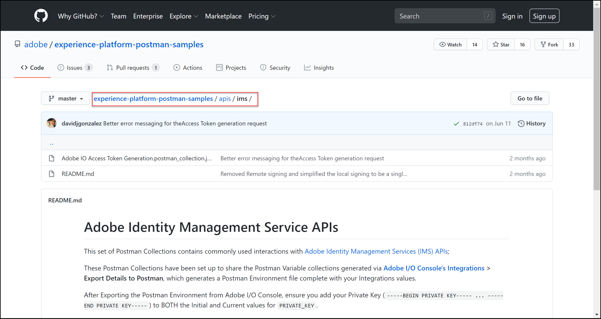

# [!DNL Adobe Target] API에 대한 인증 구성

[!DNL Recommendations Admin] API를 포함한 [!DNL Adobe Target] 관리 API는 인증된 사용자만 [!DNL Adobe Target]에 액세스할 수 있도록 인증을 통해 보호됩니다. [Adobe Developer Console](https://developer.adobe.com/console/home)을(를) 사용하여 [!DNL Adobe Target]을(를) 포함한 모든 [!DNL Adobe Experience Cloud solutions]에 대해 이 인증을 관리하세요.

>[!IMPORTANT]
>
>이 문서에 설명된 서비스 계정(JWT) 자격 증명은 새 OAuth 서버 간 자격 증명을 위해 더 이상 사용되지 않습니다.
>
>서비스 계정(JWT) 자격 증명은 2025년 1월 1일까지 계속 작동합니다. 2025년 1월 1일 이전에 애플리케이션 또는 통합을 마이그레이션하여 새로운 OAuth 서버 간 자격 증명을 사용해야 합니다.
>
>통합을 마이그레이션하는 방법에 대한 자세한 내용과 단계별 지침은 *Developer Console* 설명서의 [서비스 계정(JWT) 자격 증명에서 OAuth 서버 간 자격 증명으로 마이그레이션](https://developer.adobe.com/developer-console/docs/guides/authentication/ServerToServerAuthentication/migration/){target=_blank}을 참조하십시오.
>
>새 OAuth 자격 증명을 설정하는 방법에 대한 자세한 내용은 *Developer Console* 설명서의 [OAuth 서버 간 자격 증명 구현](https://developer.adobe.com/developer-console/docs/guides/authentication/ServerToServerAuthentication/implementation/){target=_blank}을 참조하십시오.

[!DNL Adobe Target] API와 성공적으로 상호 작용하는 데 필요한 레거시 JWT 인증 토큰을 생성하는 데 필요한 사전 단계는 다음과 같습니다.

1. [!DNL Adobe Developer Console]에서 프로젝트(이전 통합)를 만듭니다.
1. 프로젝트 세부 정보를 Postman으로 내보냅니다.
1. 전달자 액세스 토큰을 생성합니다.
1. 전달자 액세스 토큰을 테스트합니다.

## 전제 조건

| 리소스 | 세부 사항 |
| --- | --- |
| Postman | 이러한 단계를 성공적으로 완료하려면 운영 체제용 [Postman 앱](https://www.postman.com/downloads/)을(를) 가져오십시오. Postman basic은 계정 생성이 무료입니다. 일반적으로 [!DNL Adobe Target]개의 API를 사용하는 데는 필요하지 않지만 Postman을 사용하면 API 워크플로가 더 쉬워지며, [!DNL Adobe Target]에서는 API를 실행하고 작동 방법을 배울 수 있도록 여러 Postman 컬렉션을 제공합니다. 이 안내서의 나머지 부분에서는 Postman에 대한 작업 지식을 전제로 합니다. 도움이 필요하면 [Postman 설명서](https://learning.getpostman.com/)를 참조하세요. |
| 참조 | 이 안내서의 나머지 부분에서 다음 리소스에 익숙하다고 가정합니다.<ul><li>[Github Adobe I/O](https://github.com/adobeio)</li><li>[Target 관리자 및 프로필 API 설명서](../administer/admin-api/admin-api-overview-new.md)</li><li>[Recommendations API 설명서](https://developer.adobe.com/target/administer/recommendations-api/)</li></ul> |

## Adobe I/O 프로젝트 만들기

이 섹션에서는 [!DNL Adobe Developer Console]에 액세스하고 [!DNL Adobe Target]에 대한 프로젝트를 만듭니다. 자세한 내용은 프로젝트에 대한 [설명서](https://developer.adobe.com/developer-console/docs/guides/projects/)를 참조하세요.

&lt;!—(1. [인증에 대한 설명서](https://developer.adobe.com/developer-console/docs/guides/authentication/)에 따라 개인 키 및 공개 인증서를 생성합니다. // [//]: #([Adobe IO 설정 방법: 인증 - 단계별](https://helpx.adobe.com/marketing-cloud-core/kb/adobe-io-authentication-step-by-step.html)의 **단계 1**&#x200B;에 설명됨). 1단계를 완료한 후 이 안내서로 돌아가서 아래의 2단계로 다시 시작하십시오. // 이 단계의 결과는 `private.key` 파일 및 `certificate_pub.crt` 파일을 만든 것입니다. 이 두 파일을 생성했으면 이 안내서로 돌아갑니다.)—>

1. [Adobe Admin Console](https://adminconsole.adobe.com/)에서 [!DNL Adobe] 사용자 계정에 [!DNL Target]에 대한 [제품 관리자](https://helpx.adobe.com/kr/enterprise/using/admin-roles.html) 및 [개발자](https://helpx.adobe.com/kr/enterprise/using/manage-developers.html) 수준 액세스 권한이 모두 부여되었는지 확인하십시오.

1. [Adobe Developer Console](https://developer.adobe.com/console/home)에서 이 통합을 만들 [!UICONTROL Experience Cloud Organization]을(를) 선택합니다. (단일 [!UICONTROL Experience Cloud Organization]에 대한 액세스 권한만 있을 수 있습니다.)

   

1. **[!UICONTROL Create new project]** 아이콘을 클릭합니다.

   

1. [!DNL Adobe] 서비스 및 제품에 액세스하기 위해 프로젝트에 REST API를 추가하려면 **[!UICONTROL Add API]**&#x200B;을(를) 클릭하십시오.

   

1. **[!DNL Adobe Target]**&#x200B;을(를) 통합할 [!DNL Adobe] 서비스로 선택합니다. 표시되는 **[!UICONTROL Next]** 단추를 클릭합니다.

   

1. 공개 및 개인 키를 [!DNL Target]에 대해 만들고 있는 서비스 계정 통합과 연결하는 옵션을 선택하십시오. 이 예제에서는 **[!UICONTROL Option 1: Generate a key pair]**&#x200B;을(를) 선택하고 **[!UICONTROL Generate keypair]**&#x200B;을(를) 클릭합니다.

   

1. 지침에 따라 개인 키가 포함된 자동 다운로드된 구성 파일(`config`)을 메모하십시오. **[!UICONTROL Next]** 아이콘을 클릭합니다.

   

1. 파일 시스템에서 이전 단계에서 만든 압축 구성 파일인 `config`의 위치를 확인합니다. 이 `config` 파일에는 나중에 필요할 개인 키가 포함되어 있습니다. 파일 시스템 내의 정확한 위치는 여기에 표시된 위치와 다를 수 있습니다.

   

1. Adobe Developer Console으로 돌아가서 Adobe Recommendations을 사용 중인 속성에 해당하는 [제품 프로필](https://helpx.adobe.com/kr/enterprise/using/manage-products-and-profiles.html)을 선택합니다. 속성을 사용하지 않는 경우 기본 Workspace 옵션을 선택합니다. **[!UICONTROL Save configured API]** 아이콘을 클릭합니다.

   

1. **[!UICONTROL Create Integration]**&#x200B;을(를) 클릭합니다. API가 성공적으로 구성되었음을 나타내는 임시 메시지를 수신해야 합니다.
1. 마지막 단계로 프로젝트 이름을 원래 `Project 1`보다 의미 있는 이름으로 바꾸십시오. 이렇게 하려면 탐색 경로를 표시로 사용하여 프로젝트로 이동하고 **[!UICONTROL Edit project]**&#x200B;을(를) 클릭하여 **[!UICONTROL Edit Project]** 모달에 액세스한 다음 프로젝트 이름을 변경합니다.

   

>[!NOTE]
>
>이 예제에서는 프로젝트 이름을 &quot;[!DNL Target] 통합&quot;으로 지정합니다. [!DNL Adobe Target] 이상 동안 프로젝트를 사용할 것으로 예상되면 그에 따라 이름을 지정할 수 있습니다. 예를 들어 Adobe Experience Cloud의 다른 솔루션과 함께 사용할 수 있으므로 이름을 &quot;Adobe API&quot; 또는 &quot;Experience Cloud API&quot;로 지정할 수 있습니다.

## 프로젝트 세부 정보 내보내기

[!DNL Target]에 액세스하는 데 사용할 수 있는 Adobe 프로젝트가 있으므로 Adobe API 요청과 함께 해당 프로젝트의 세부 정보를 보내야 합니다. 여러 [!DNL Target] API를 포함하여 여러 Adobe API와 상호 작용하려면 이러한 세부 정보가 필요합니다. 예를 들어 통합 세부 정보에는 [!DNL Target] 관리 API에 필요한 권한 부여 및 인증 정보가 포함됩니다. 따라서 Postman에서 API를 사용하려면 해당 세부 정보를 Postman에 가져와야 합니다.

Postman에서 프로젝트의 세부 정보를 지정하는 방법에는 여러 가지가 있지만 이 섹션에서는 일부 사전 빌드된 기능 및 컬렉션을 활용합니다. 먼저 (이 섹션에서) 통합 세부 사항을 Postman 환경으로 내보냅니다. 다음 섹션에서 필요한 Adobe 리소스에 대한 액세스 권한을 부여하기 위한 전달자 액세스 토큰을 생성합니다.

>[!NOTE]
>
>[!DNL Target]을(를) 포함하여 모든 Experience Cloud 솔루션에 적용할 수 있는 비디오 지침은 [Experience Platform API와 함께 Postman 사용](https://experienceleague.adobe.com/docs/platform-learn/tutorials/platform-api-authentication.html?lang=ko)을 참조하십시오. 다음 섹션은 [!DNL Target] API와 관련이 있습니다. 1. Experience Platform API를 만들고 Postman 2로 내보냅니다. Postman을 사용하여 액세스 토큰을 생성합니다. 이러한 단계는 아래에 나와 있습니다.

1. [Adobe Developer Console](https://developer.adobe.com/console/home)에서 새 프로젝트의 **[!UICONTROL Service Account (JWT)]** 자격 증명을 보려면 이동하십시오. 표시된 대로 왼쪽 탐색 또는 **[!UICONTROL Credentials]** 섹션을 사용합니다.

   

   **[!UICONTROL Credential details]**&#x200B;에서 **[!UICONTROL Public key(s)]**, **[!UICONTROL Client ID]** 및 서비스 계정과 관련된 기타 정보를 볼 수 있습니다.

   

1. **[!DNL Adobe Target]** API에 대한 정보로 이동하려면 클릭하십시오. 표시된 대로 왼쪽 탐색 또는 **연결된 제품 및 서비스** 섹션을 사용합니다.

   

1. Postman 환경에 대한 인증 정보를 캡처하는 JSON 파일을 만들려면 **[!UICONTROL Download for Postman]** > **[!UICONTROL Service Account (JWT)]**&#x200B;을(를) 클릭합니다.

   

   파일 시스템의 JSON 파일을 확인합니다.

   

1. Postman에서 톱니바퀴 아이콘을 클릭하여 환경을 관리한 다음 **[!UICONTROL Import]**&#x200B;을(를) 클릭하여 JSON 파일(환경)을 가져옵니다.

   

1. 파일을 선택하고 **[!UICONTROL Open]**&#x200B;을(를) 클릭합니다.

   

1. Postman **환경 관리** 모달에서 새로 가져온 환경의 이름을 클릭하여 검사합니다. (환경 이름은 여기에 표시된 이름과 다를 수 있습니다. 원하는 대로 이름을 편집합니다. [!DNL Adobe] 프로젝트의 이름과 일치할 필요는 없습니다.

   

1. 참고 `CLIENT_SECRET` 및 `API_KEY`(다른 변수와 함께)에는 Adobe Developer Console에 정의된 대로 통합에서 가져온 값이 미리 채워져 있습니다. (Postman `CLIENT_SECRET` 변수는 Developer Console에 표시된 `CLIENT SECRET` Adobe 자격 증명과 일치해야 하며 Postman의 `API_KEY`도 Developer Console의 `CLIENT ID`과(와) 일치해야 합니다.) 반대로 메모 `PRIVATE_KEY`, `JWT_TOKEN` 및 `ACCESS_TOKEN`은(는) 비어 있습니다. 먼저 `PRIVATE_KEY` 값을 제공하겠습니다.

   

1. 파일 시스템에서 `config` 파일을 열고 `private` 키 파일을 엽니다.

   

1. `private` 키 파일의 전체 내용을 선택하고 복사합니다.

   

1. Postman에서 개인 키 값을 **[!UICONTROL INITIAL VALUE]** 및 **[!UICONTROL CURRENT VALUE]** 필드에 붙여 넣습니다.

   

1. **[!UICONTROL Update]**&#x200B;을(를) 클릭하고 환경 모달을 닫습니다.

## 전달자 액세스 토큰 생성

이 섹션에서는 [!DNL Adobe Target] API와의 상호 작용을 인증하는 데 필요한 전달자 액세스 토큰을 생성합니다. 전달자 액세스 토큰을 생성하려면 통합 세부 정보(이전 섹션에서 설정됨)를 [IMS(Identity Management 서비스) Adobe](https://www.adobe.io/authentication/auth-methods.html#!AdobeDocs/adobeio-auth/master/AuthenticationOverview/AuthenticationGuide.md)로 보내야 합니다. 이 작업을 수행하는 방법에는 몇 가지가 있지만, 이 안내서에서는 프로세스를 직접적이고 쉽게 만드는 사전 설치된 IMS 호출이 포함된 Postman 컬렉션을 사용합니다. 컬렉션을 가져오면 필요할 때마다 다시 사용하여 [!DNL Adobe Target]뿐만 아니라 다른 Adobe API에 대해서도 새 토큰을 생성할 수 있습니다.

1. [Adobe Identity Management 서비스 API 샘플 호출](https://github.com/adobe/experience-platform-postman-samples/tree/master/apis/ims)(으)로 이동합니다.

   

1. **[!UICONTROL Adobe I/O Access Token Generation Postman collection]**&#x200B;을(를) 클릭합니다.

   

1. **[!UICONTROL Raw]**&#x200B;을(를) 클릭한 다음 결과 JSON을 클립보드에 복사하여 이 컬렉션에 대한 원시 JSON을 가져옵니다. (또는 원시 JSON을 .json 파일로 저장할 수 있습니다.)

   

1. Postman에서 클립보드에서 원시 JSON을 붙여 넣고 제출하여 컬렉션을 가져옵니다. (또는 저장한 .json 파일을 업로드할 수 있습니다.) **[!UICONTROL Continue]** 아이콘을 클릭합니다.

   

1. Adobe I/O 액세스 토큰 생성 Postman 컬렉션에서 **[!UICONTROL IMS: JWT Generate + Auth via User Token]** 요청을 선택하고 환경이 선택되어 있는지 확인한 다음 **[!UICONTROL Send]**&#x200B;을(를) 클릭하여 토큰을 생성합니다.

   

   >[!NOTE]
   >
   >이 전달자 액세스 토큰은 24시간 동안 유효합니다. 새 토큰을 생성해야 할 때마다 요청을 다시 보냅니다.

1. 환경 관리 모달을 다시 열고 환경을 선택합니다.

   

1. 이제 `ACCESS_TOKEN` 및 `JWT_TOKEN` 값이 채워집니다.

   

질문: JSON 웹 토큰(JWT) 및 전달자 액세스 토큰을 생성하기 위해 Adobe I/O 액세스 토큰 생성 Postman 컬렉션을 사용해야 합니까?

답변: 아니요. Adobe I/O 액세스 토큰 생성 Postman 컬렉션은 Postman에서 JWT 및 전달자 액세스 토큰을 보다 쉽게 생성할 수 있는 편리성으로 제공됩니다. 또는 Adobe Developer Console 내의 기능을 사용하여 액세스 전달자 토큰을 수동으로 생성할 수 있습니다.

## 전달자 액세스 토큰 테스트

이 연습에서는 [!DNL Target] 계정에서 활동 목록을 검색하는 API 요청을 전송하여 새 전달자 액세스 토큰을 사용합니다. 응답이 성공하면 [!DNL Adobe] 프로젝트와 인증이 API를 사용하기 위해 예상대로 작동하고 있음을 나타냅니다.

1. [[!DNL Adobe Target] 관리 API Postman 컬렉션](https://developers.adobetarget.com/api/#admin-postman-collection)을(를) 가져옵니다. Postman에서 컬렉션을 가져올 때까지 모든 프롬프트를 따릅니다.

   

1. 컬렉션을 확장하고 **[!UICONTROL List activities]** 요청을 확인합니다.

   

1. `{{access_token}}`과(와) 같은 변수는 처음에 확인되지 않습니다. 여러 가지 방법으로 해결할 수 있습니다. 예를 들어 `{{access_token}}`이라는 새 컬렉션 변수를 정의할 수 있지만, 이 안내서에서는 이전에 사용 중이던 Postman 환경을 활용하도록 API 요청을 대신 변경합니다. 이렇게 하면 환경이 Adobe API에서 공통되는 모든 변수를 일관되게 단일 통합으로 계속 사용할 수 있습니다.

   

1. `{{access_token}}`을(를) `{{ACCESS_TOKEN}}`(으)로 바꾸려면 입력하세요.

   

1. `{{api_key}}`을(를) `{{API_KEY}}`(으)로 바꾸려면 입력하세요.

   

1. `{{tenant}}`을(를) `{{TENANT_ID}}`(으)로 바꾸려면 입력하세요. 메모 `{{TENANT_ID}}`을(를) 아직 인식할 수 없습니다.

   

1. 환경 관리 모달을 열고 환경을 선택합니다.

   

1. 새 `{{TENANT_ID}}` 환경 변수를 추가하려면 입력하십시오. 테넌트 ID 값을 복사하여 새 `TENANT_ID` 환경 변수의 **[!UICONTROL INITIAL VALUE]** 및 **[!UICONTROL CURRENT VALUE]** 필드에 붙여넣으십시오.

   

   >[!NOTE]
   >
   >테넌트 ID가 [!DNL Target] `clientcode`과(와) 다릅니다. [!DNL Target]에 로그인한 URL에 테넌트 ID가 있습니다. 테넌트 ID를 얻으려면 Adobe Experience Cloud에 로그인하고 [!DNL Target]을(를) 열고 Target 카드를 클릭합니다. URL 하위 도메인에 언급된 대로 테넌트 ID 값을 사용합니다. 예를 들어 [!DNL Adobe Target]에 로그인할 때 URL이 `<https://mycompany.experiencecloud.adobe.com/...>`이면 테넌트 ID는 &quot;mycompany&quot;입니다.

1. 올바른 환경을 선택했는지 확인한 후 요청을 보냅니다. 활동 목록이 포함된 응답을 수신해야 합니다.

   

이제 Adobe 인증을 확인했으므로 이를 사용하여 [!DNL Adobe Target] API(및 다른 Adobe API)와 상호 작용할 수 있습니다. 예를 들어 [Recommendations API를 사용](recs-api/overview.md)하여 권장 사항을 만들거나 관리하거나 [Target 배달 API](/help/dev/implement/delivery-api/overview.md)와 함께 사용할 수 있습니다.
