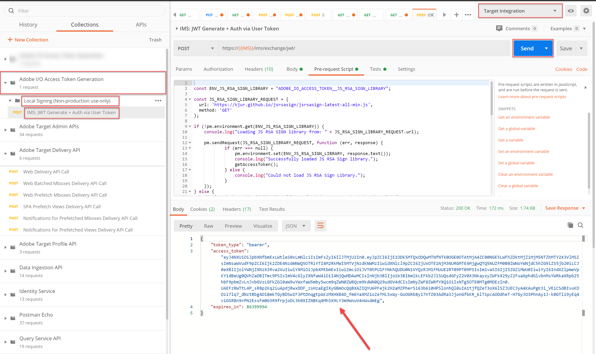

# API를 사용하여 Recommendations 카탈로그 관리

다음을 충족하도록 보장 [Recommendations API 사용 요구 사항](/help/dev/before-administer/recs-api/overview.md#prerequisites)을 통해 학습 내용: [액세스 토큰 생성](/help/dev/before-administer/configure-authentication.md) jwt 인증 플로우를 사용하여 [!DNL Adobe Target] 의 관리 API [Adobe Developer 콘솔](https://developer.adobe.com/console/home).

이제 다음을 사용할 수 있습니다. [RECOMMENDATIONS API](https://developer.adobe.com/target/administer/recommendations-api/) 추천 카탈로그에서 항목을 추가, 업데이트 또는 삭제합니다. 나머지 Adobe Target 관리 API와 마찬가지로 Recommendations API도 인증이 필요합니다.

>[!NOTE]
>
>보내기 **[!UICONTROL IMS: JWT 생성 + 사용자 토큰을 통한 인증]** 액세스 토큰은 24시간 후에 만료되므로 인증을 위해 새로 고쳐야 할 때마다 요청합니다. 다음을 참조하십시오 [Adobe API 인증 구성](../configure-authentication.md) 설명서를 참조하십시오.



계속하기 전에 [Recommendations Postman 컬렉션](https://developer.adobe.com/target/administer/recommendations-api/#section/Postman).

## 엔티티 저장 API를 사용하여 항목 생성 및 업데이트

제품 페이지에서 실행되는 CSV 제품 피드 또는 Target 요청이 아닌 API를 사용하여 Recommendations 제품 데이터베이스를 채우려면 [엔티티 API 저장](https://developer.adobe.com/target/administer/recommendations-api/#operation/saveEntities). 이 요청은 단일 Target 환경에서 항목을 추가하거나 업데이트합니다. 구문은 입니다.

```
POST https://mc.adobe.io/{{TENANT_ID}}/target/recs/entities
```

예를 들어 특정 임계값(예: 재고 임계값 또는 가격 임계값)이 충족될 때마다 항목을 업데이트하여 해당 항목에 플래그를 지정하고 이러한 항목을 권장하지 않도록 하는 데 엔티티 저장을 사용할 수 있습니다.

1. 다음으로 이동 **[!UICONTROL Target]** > **[!UICONTROL 설정]** > **[!UICONTROL 호스트]** > **[!UICONTROL 환경 제어]** 항목을 추가하거나 업데이트할 Target 환경 ID를 얻습니다.

   

1. 확인 `TENANT_ID` 및 `API_KEY` 이전에 설정한 Postman 환경 변수를 참조하십시오. 비교를 위해 아래 이미지를 사용하십시오. 필요한 경우 API 요청의 헤더와 경로를 아래 이미지의 헤더와 일치하도록 수정합니다.

   

1. JSON 입력 **raw** 의 코드 **본문**. 다음을 사용하여 환경 ID를 지정하는 것을 잊지 마십시오 `environment` 변수를 채우는 방법에 따라 페이지를 순서대로 표시합니다. (아래 예에서 환경 ID는 6781입니다.)

   

   다음은 토스터 오븐 제품에 대한 관련 엔티티 값이 있는 entity.id kit2001을 환경 6781에 추가하는 샘플 JSON입니다.

   ```
       {
       "entities": [{
               "name": "Toaster Oven",
               "id": "kit2001",
               "environment": 6781,
               "categories": [
                   "housewares:appliances"
               ],
               "attributes": {
                   "inventory": 77,
                   "margin": 23,
                   "message": "crashing helicopter",
                   "pageUrl": "www.foobar.foo.com/helicopter.html",
                   "thumbnailUrl": "www.foobar.foo.com/helicopter.jpg",
                  "value": 19.2
               }
           }]
       }
   ```

1. **[!UICONTROL 보내기]**&#x200B;를 클릭합니다. 다음 응답을 수신해야 합니다.

   

   JSON 개체는 여러 제품을 보내도록 크기를 조정할 수 있습니다. 예를 들어 이 JSON은 두 개의 엔티티를 지정합니다.

   ```
       {
           "entities": [{
                   "name": "Toaster Oven",
                   "id": "kit2001",
                   "environment": 6781,
                   "categories": [
                       "housewares:appliances"
                   ],
                   "attributes": {
                       "inventory": 89,
                       "margin": 11,
                       "message": "Toaster Oven",
                       "pageUrl": "www.foobar.foo.com/helicopter.html",
                       "thumbnailUrl": "www.foobar.foo.com/helicopter.jpg",
                       "value": 102.5
                   }
               },
               {
                   "name": "Blender",
                   "id": "kit2002",
                   "environment": 6781,
                   "categories": [
                       "housewares:appliances"
                   ],
                   "attributes": {
                       "inventory": 36,
                       "margin": 5,
                       "message": "Blender",
                       "pageUrl": "www.foobar.foo.com/helicopter.html",
                       "thumbnailUrl": "www.foobar.foo.com/helicopter.jpg",
                       "value": 54.5
                   }
               }
           ]
       }
   ```

1. 이제 네 차례야! 사용 **[!UICONTROL 엔티티 저장]** 카탈로그에 다음 항목을 추가하기 위한 API입니다. 위의 샘플 JSON을 시작점으로 사용하십시오. (추가 엔티티를 포함하려면 JSON을 확장해야 합니다.)

   

마지막 두 항목이 포함되어 있지 않은 것 같습니다. 다음을 사용하여 검사해 보겠습니다. **[!UICONTROL 엔티티 가져오기]** API를 참조하고, 필요한 경우 **[!UICONTROL 엔티티 삭제]** API.

## 엔티티 가져오기 API를 사용하여 항목 세부 정보를 가져오는 중

기존 항목의 세부 정보를 검색하려면 [엔티티 API 가져오기](https://developer.adobe.com/target/administer/recommendations-api/#operation/getEntity). 구문은 입니다.

```
GET https://mc.adobe.io/{{TENANT_ID}}/target/recs/entities/[entity.id]
```

한 번에 하나의 엔티티에 대해서만 엔티티 세부 정보를 검색할 수 있습니다. 엔티티 가져오기 를 사용하여 카탈로그에 예상대로 업데이트되었는지 확인하거나 카탈로그의 컨텐츠를 감사할 수 있습니다.

1. API 요청에서 변수를 사용하여 엔티티 ID를 지정합니다 `entityId`. 다음 예에서는 entityId=kit2004인 엔티티에 대한 세부 정보를 반환합니다.

   

1. 확인 `TENANT_ID` 및 `API_KEY` 이전에 설정한 Postman 환경 변수를 참조하십시오. 비교를 위해 아래 이미지를 사용하십시오. 필요한 경우 API 요청의 헤더와 경로를 아래 이미지의 헤더와 일치하도록 수정합니다.

   

1. 요청을 보냅니다.

   
위의 예에서 보듯이 엔티티를 찾을 수 없다는 오류 메시지가 표시되면 요청을 올바른 Target 환경에 제출하고 있는지 확인합니다.


   >[!NOTE]
   >
   >환경이 명시적으로 지정되지 않은 경우 엔티티 가져오기 는 [기본 환경](https://experienceleague.adobe.com/docs/target/using/administer/environments.html) 만 해당. 기본 환경이 아닌 다른 환경에서 가져오려면 환경 ID를 지정해야 합니다.

1. 필요한 경우 `environmentId` 매개 변수를 지정한 후 요청을 다시 보냅니다.

   

1. 다른 항목 보내기 **[!UICONTROL 엔티티 가져오기]** request, 이번에는 entityId=kit2005인 엔티티를 검사하십시오.

   

이러한 엔티티를 카탈로그에서 제거해야 한다고 결정한다고 가정합니다. 을(를) 사용합니다. **[!UICONTROL 엔티티 삭제]** API.

## 엔티티 삭제 API를 사용하여 항목 삭제

카탈로그에서 항목을 제거하려면 [엔티티 API 삭제](https://developer.adobe.com/target/administer/recommendations-api/#operation/deleteEntities). 구문은 입니다.

```
DELETE https://mc.adobe.io/{{TENANT_ID}}/target/recs/entities?ids=[comma-delimited-entity-ids]&environment=[environmentId]
```

>[!WARNING]
>
>엔티티 삭제 API는 지정한 ID에 의해 참조되는 엔티티를 삭제합니다. 제공된 엔티티 ID가 없는 경우 해당 환경의 모든 엔티티가 삭제됩니다. 환경 ID가 제공되지 않으면 엔티티가 모든 환경에서 삭제됩니다. 이것을 조심해서 사용하세요!

1. 다음으로 이동 **[!UICONTROL Target]** > **[!UICONTROL 설정]** > **[!UICONTROL 호스트]** > **[!UICONTROL 환경]** 항목을 삭제할 Target 환경 ID를 얻습니다.

   

1. API 요청에서 구문을 사용하여 삭제할 엔티티의 엔티티 ID를 지정합니다 `&ids=[comma-delimited-entity-ids]` (쿼리 매개 변수). 둘 이상의 엔티티를 삭제하는 경우 쉼표를 사용하여 ID를 구분하십시오.

   

1. 구문을 사용하여 환경 ID를 지정합니다 `&environment=[environmentId]`, 그렇지 않으면 모든 환경의 엔티티가 삭제됩니다.

   

1. 확인 `TENANT_ID` 및 `API_KEY` 이전에 설정한 Postman 환경 변수를 참조하십시오. 비교를 위해 아래 이미지를 사용하십시오. 필요한 경우 API 요청의 헤더와 경로를 아래 이미지의 헤더와 일치하도록 수정합니다.

   

1. 요청을 보냅니다.

   

1. 다음을 사용하여 결과 확인 **[!UICONTROL 엔티티 가져오기]**&#x200B;이제 삭제된 엔티티를 찾을 수 없음을 나타내야 합니다.

   

   

축하합니다! 이제 Recommendations API를 사용하여 카탈로그의 엔터티에 대한 세부 사항을 만들고, 업데이트하고, 삭제하고, 가져올 수 있습니다. 다음 섹션에서는 사용자 지정 기준을 관리하는 방법에 대해 알아봅니다.

&lt;!— [다음 &quot;사용자 지정 기준 관리&quot; >](manage-custom-criteria.md) —>
