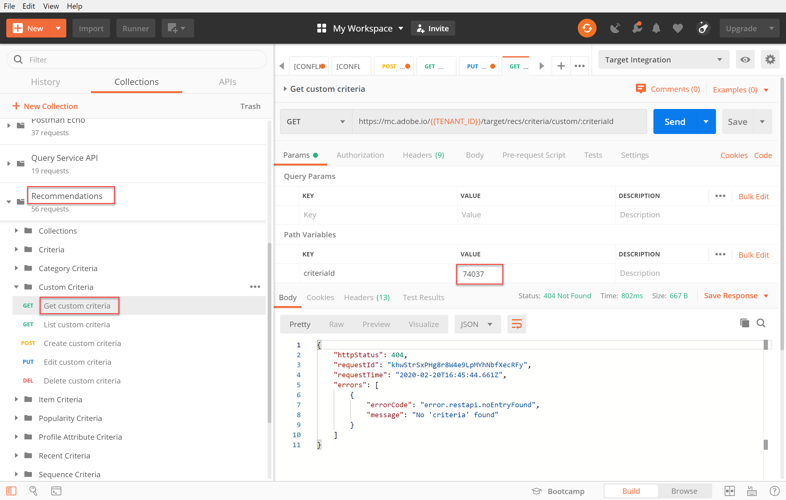

# 사용자 지정 기준 관리

경우에 따라 Recommendations에서 제공하는 알고리즘에서 홍보하려는 특정 항목을 표시하지 못할 수 있습니다. 이러한 상황에서 사용자 지정 기준은 주어진 주요 항목 또는 카테고리에 대한 특정 권장 항목 세트를 전달할 수 있는 방법을 제공합니다.

사용자 지정 기준을 만들려면 키 항목 또는 범주와 권장 항목 간에 원하는 매핑을 정의하고 가져옵니다. 이 프로세스는 다음에 설명되어 있습니다. [사용자 지정 기준 설명서](https://experienceleague.adobe.com/docs/target/using/recommendations/criteria/recommendations-csv.html). 해당 설명서에서 설명한 대로 Target UI(사용자 인터페이스)를 통해 사용자 지정 기준을 만들고, 편집하고, 삭제할 수 있습니다. 하지만, Target은 사용자 지정 기준을 더 자세히 관리할 수 있도록 해주는 일련의 사용자 지정 기준 API도 제공합니다.

>[!WARNING]
>
>사용자 지정 기준의 경우 API를 사용하여 지정된 사용자 지정 기준에 대한 모든 작업(만들기, 편집, 삭제)을 수행하거나 UI를 사용하여 모든 작업(만들기, 편집, 삭제)을 수행합니다. UI와 API의 조합을 통해 사용자 지정 기준을 관리하면 정보가 충돌하거나 예기치 않은 결과가 발생할 수 있습니다. 예를 들어, UI에서 사용자 지정 기준을 만든 다음 API를 통해 편집하면 API를 통해 볼 수 있듯이 백엔드에서 업데이트되더라도 UI에서 업데이트가 반영되지 않습니다.

## 사용자 지정 기준 만들기

을 사용하여 사용자 지정 기준을 만들려면 [사용자 지정 기준 API 만들기](https://developers.adobetarget.com/api/recommendations/#operation/createCriteriaCustom)구문:

`POST https://mc.adobe.io/{{TENANT_ID}}/target/recs/criteria/custom`

>[!WARNING]
>
>이 연습에서 설명한 대로 사용자 지정 기준 만들기 API를 사용하여 만든 사용자 지정 기준이 UI에 나타나고 여기서 지속됩니다. UI에서 편집하거나 삭제할 수 없습니다. 편집하거나 삭제할 수 있습니다. **API를 통해**, 하지만 어느 경우든 Target UI에 계속 표시됩니다. UI에서 편집하거나 삭제하는 옵션을 유지 관리하려면에 대한 UI를 사용하여 사용자 지정 기준을 만듭니다 [설명서](https://experienceleague.adobe.com/docs/target/using/recommendations/criteria/recommendations-csv.html), 사용자 지정 기준 만들기 API를 사용하는 것과 대조적입니다.

위의 경고를 읽고 UI에서 이후에 삭제할 수 없는 새 사용자 지정 기준을 쉽게 만든 후에만 다음 단계를 수행하십시오.

1. 확인 `TENANT_ID` 및 `API_KEY` 대상 **[!UICONTROL 사용자 지정 기준 만들기]** 이전에 설정한 Postman 환경 변수를 참조하십시오. 비교를 위해 아래 이미지를 사용하십시오.

   

1. 사용자 추가 **본문** 다음으로: **raw** 사용자 지정 기준 CSV 파일의 위치를 정의하는 JSON. 에 제공된 예제 사용 [사용자 지정 기준 API 만들기](https://developers.adobetarget.com/api/recommendations/#operation/getAllCriteriaCustom) 템플릿을 위한 설명서 `environmentId` 및 기타 값(필요한 경우) 이 예에서는 LAST_PURCHASED를 키로 사용합니다.

   

1. 요청을 보내고 방금 만든 사용자 지정 기준의 세부 사항이 포함된 응답을 관찰합니다.

   

1. 사용자 지정 기준이 생성되었는지 확인하려면 Adobe Target 내에서 다음으로 이동합니다. **[!UICONTROL Recommendations > 기준]** 이름으로 기준을 검색하거나 **[!UICONTROL 목록 사용자 지정 기준 API]** 을 누릅니다.

   

이 경우 오류가 발생합니다. 다음을 사용하여 사용자 지정 기준을 더 자세히 검사하여 오류를 조사하겠습니다. **[!UICONTROL 목록 사용자 지정 기준 API]**.

## 사용자 지정 기준 나열

각각에 대한 세부 정보와 함께 모든 사용자 지정 기준 목록을 검색하려면 [목록 사용자 지정 기준 API](https://developers.adobetarget.com/api/recommendations/#operation/getAllCriteriaCustom). 구문은 입니다.

`GET https://mc.adobe.io/{{TENANT_ID}}/target/recs/criteria/custom`

1. 확인 `TENANT_ID` 및 `API_KEY` 이전과 마찬가지로 을 호출하고 요청을 보냅니다. 응답에서 사용자 지정 기준 ID와 이전에 기록한 오류 메시지에 대한 세부 사항을 확인합니다.
   

이 경우 서버 정보가 잘못되었기 때문에 오류가 발생했습니다. 즉, Target이 사용자 지정 기준 정의가 포함된 CSV 파일에 액세스할 수 없습니다. 이 문제를 해결하기 위해 사용자 지정 기준을 편집해 보겠습니다.

## 사용자 지정 기준 편집

사용자 지정 기준 정의의 세부 사항을 변경하려면 [사용자 지정 기준 API 편집](https://developers.adobetarget.com/api/recommendations/#operation/updateCriteriaCustom). 구문은 입니다.

`POST https://mc.adobe.io/{{TENANT_ID}}/target/recs/criteria/custom/:criteriaId`

1. 확인 `TENANT_ID` 및 `API_KEY`이전과 마찬가지로
   

1. 편집할 (단일) 사용자 지정 기준의 기준 ID를 지정합니다.
   

1. 본문에서 업데이트된 JSON에 올바른 서버 정보를 제공합니다. (이 단계에서는 액세스할 수 있는 서버에 대한 FTP 액세스를 지정합니다.)
   

1. 요청을 보내고 응답을 확인합니다.
   

를 사용하여 업데이트된 사용자 지정 기준의 성공 여부를 확인하겠습니다. **[!UICONTROL 사용자 지정 기준 API 가져오기]**.

## 사용자 지정 기준 가져오기

특정 사용자 지정 기준에 대한 사용자 지정 기준 세부 정보를 보려면 [사용자 지정 기준 API 가져오기](https://developers.adobetarget.com/api/recommendations/#operation/getCriteriaCustom). 구문은 입니다.

`GET https://mc.adobe.io/{{TENANT_ID}}/target/recs/criteria/custom/:criteriaId`

1. 세부 정보를 가져오려는 사용자 지정 기준의 기준 ID를 지정합니다. 요청을 보내고 응답을 검토합니다.
   
1. 성공 여부를 확인합니다. (이 예제에서는 더 이상의 FTP 오류가 없는지 확인합니다.)
   
1. (선택 사항) 업데이트가 UI에 정확하게 반영되는지 확인합니다.
   

## 사용자 지정 기준 삭제

앞에서 언급한 기준 ID를 사용하여 다음을 사용하여 사용자 지정 기준을 삭제합니다. [사용자 지정 기준 API 삭제](https://developers.adobetarget.com/api/recommendations/#operation/deleteCriteriaCustom). 구문은 입니다.

`DELETE https://mc.adobe.io/{{TENANT_ID}}/target/recs/criteria/custom/:criteriaId`

1. 삭제하려는 (단일) 사용자 지정 기준의 기준 ID를 지정합니다. **[!UICONTROL 보내기]**를 클릭합니다.
   

1. 사용자 지정 기준 가져오기를 사용하여 기준이 삭제되었는지 확인합니다.
   
이 경우 예상 404 오류는 삭제된 기준을 찾을 수 없음을 나타냅니다.

>[!NOTE]
>
>다시 말해서, 기준은 사용자 지정 기준 만들기 API를 사용하여 생성되었으므로 삭제되더라도 Target UI에서 제거되지 않습니다.

축하합니다! 이제 Recommendations API를 사용하여 사용자 지정 기준을 만들고, 나열하고, 편집하고, 삭제하고, 세부 정보를 가져올 수 있습니다. 다음 섹션에서는 Target 배달 API를 사용하여 권장 사항을 검색합니다.

&lt;!— [다음 &quot;서버측 배달 API로 Recommendations 가져오기&quot; >](fetch-recs-server-side-delivery-api.md) —>
