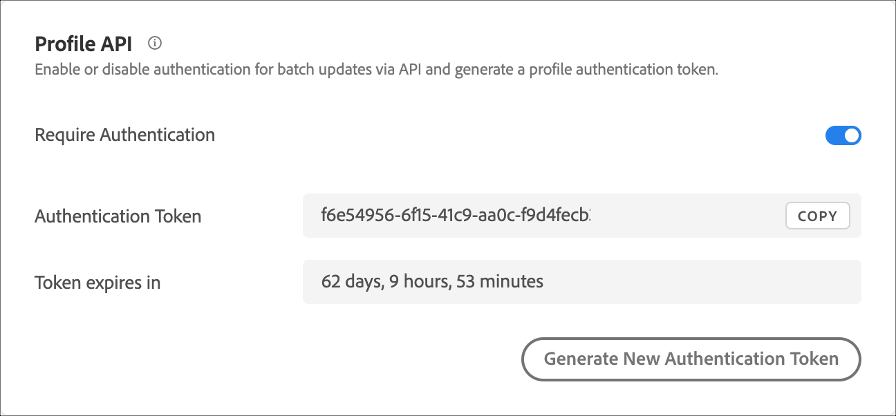

# 프로필 API 설정

[!DNL Adobe Target] API를 통해 일괄 업데이트 인증을 활성화하거나 비활성화하고 프로필 인증 토큰을 생성합니다.

[!DNL Adobe Target]은(는) 모든 개별 사용자에 대한 프로필을 만들고 유지 관리합니다. 이 프로필은 [!DNL Target] 에지 클러스터에 저장되며 방문할 때마다 실시간으로 업데이트됩니다. API를 통해 프로필을 개별적으로 또는 대량으로 업데이트할 수도 있습니다.

추가 보안을 위해 벌크 업데이트 API 호출 시 요청의 헤더에서 전달할 올바른 액세스 토큰을 요구할 수 있습니다.

**인증을 요구하고 [!DNL Target] UI를 사용하여 액세스 토큰을 생성하려면:**

1. **[!UICONTROL Administration]** > **[!UICONTROL Implementation]**&#x200B;을(를) 클릭합니다.
1. **[!UICONTROL Profile API]**&#x200B;에서 **[!UICONTROL Require Authentication]**&#x200B;을(를) 사용 또는 사용 안 함 위치로 전환합니다.

   

1. (조건부) 인증 요구 사항을 사용하도록 설정한 경우 **[!UICONTROL Generate New Profile Authentication Token]**&#x200B;을(를) 클릭합니다.

   

   토큰은 다음 기간 후에 만료 상자에 나열된 시간에 따라 만료됩니다.

   인증 토큰을 생성하려면 다음 사용자 권한 중 하나가 있어야 합니다.

   * 책임자 역할 또는 최소 승인자 권한이 있어야 합니다.

     Target Standard 고객에 대한 자세한 내용은 *사용자*&#x200B;의 [역할 및 권한 지정](https://experienceleague.adobe.com/docs/target/using/administer/manage-users/users/user-management.html?lang=ko#roles-permissions)을 참조하십시오. [!DNL Target Premium] 고객에 대한 자세한 내용은 [기업 권한 구성](https://experienceleague.adobe.com/docs/target/using/administer/manage-users/enterprise/properties-overview.html?lang=ko)을 참조하십시오.

   * 작업 영역/제품 프로필 수준에서 관리자 역할

     작업 영역은 [!DNL Target Premium] 고객만 사용할 수 있습니다. 자세한 내용은 [기업 권한 구성](https://experienceleague.adobe.com/docs/target/using/administer/manage-users/enterprise/properties-overview.html?lang=ko)을 참조하십시오.

   * [!DNL Adobe Target] 제품 수준의 관리자 권한(Sysadmin 권한)

API를 통해 프로필 인증 토큰을 생성할 수도 있습니다. 자세한 내용은 [Adobe Target 관리 및 프로필 API 안내서](../../administer/admin-api/admin-api-overview-new.md)의 &quot;프로필&quot;을 참조하십시오.

1. 토큰을 복사하고 &quot;Authorization&quot; : &quot;Bearer&quot; 형식으로 요청 헤더에 포함합니다.

1. 필요에 따라 토큰을 재생성하려면 **[!UICONTROL Generate New Profile Authentication Token]**&#x200B;을(를) 클릭하십시오.

>[!WARNING]
>
>이 토큰을 재설정하면 현재 토큰을 사용하는 API 호출이 실패하게 됩니다. 따라서 이 토큰을 재설정한 경우 이 토큰을 사용하는 모든 스크립트나 앱을 업데이트해야 합니다.
