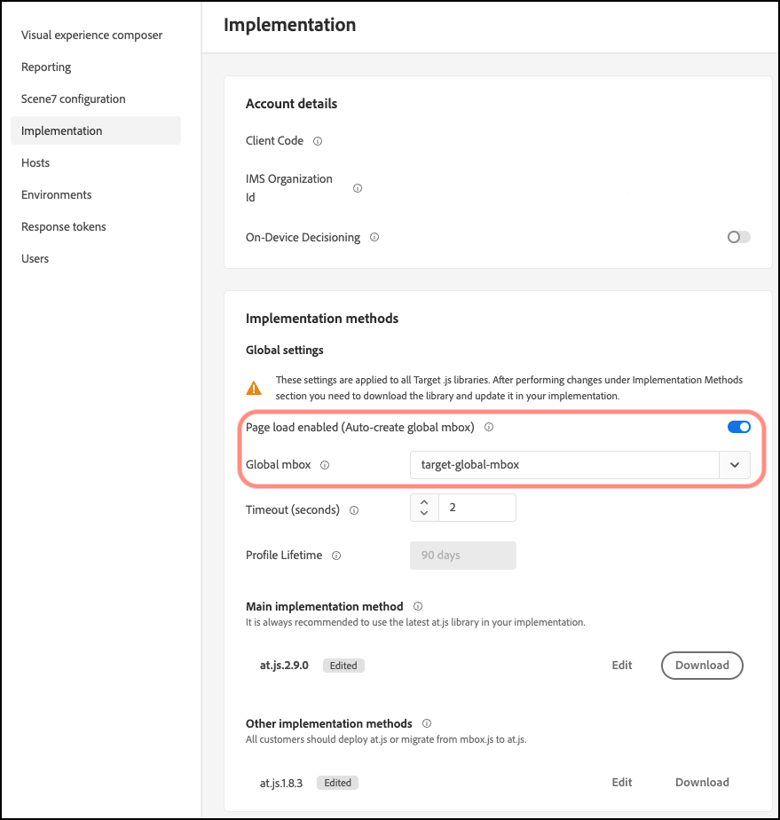

# 글로벌 mbox 사용자 지정

at.js에 대한 [!DNL Adobe Target] 글로벌 mbox를 사용자 지정하는 데 도움이 되는 정보입니다.

1. **[!UICONTROL Administration]** > **[!UICONTROL Implementation]**&#x200B;을(를) 클릭합니다.

1. **[!UICONTROL Page load enabled (Auto create global mbox)]**&#x200B;을(를) 사용하지 않도록 설정한 다음 [!DNL Target]에서 활동을 전달하는 데 사용할 사용자 지정 글로벌 mbox의 이름을 추가하십시오.

>[!WARNING]
>
>다른 글로벌 mbox를 선택하면 변경 사항이 자동으로 저장됩니다.

이 사용자 지정 mbox도 클릭 추적에 사용됩니다.

1. 사이트에서 at.js 라이브러리를 구현합니다.

   자세한 내용은 [at.js를 배포하는 방법](/help/dev/implement/client-side/atjs/how-to-deployatjs/how-to-deployatjs.md)을 참조하세요.

1. 전환 시간을 릴리스에 맞춰 지정합니다.

   [!DNL Target]에서 향후 모든 활동에 대해 글로벌 mbox를 사용할 준비가 되면 이 단계를 진행할 수 있습니다.

   위의 2단계에서 사용되는 이름과 일치하도록 사용자 지정 글로벌 mbox의 이름을 업데이트합니다.

>[!WARNING]
>
>계정의 모든 활동이 이 mbox와 동기화됩니다. 활동이 계속 작동할 수 있도록 글로벌 mbox가 사이트에 있는지 확인하십시오. 이 mbox와 동기화하는 [!UICONTROL Visual Experience Composer] (VEC)을(를) 사용하여 만든 영향을 받는 활동을 편집하고 다시 저장하십시오. [!UICONTROL Form-Based Experience Composer] 또는 API를 통해 만든 활동을 다시 저장할 필요는 없습니다.
