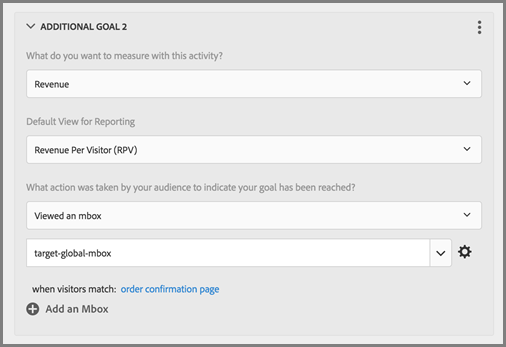

# 글로벌 mbox FAQ

글로벌 mbox에 대한 FAQ 목록

## [!DNL Target] 계정이 여러 도메인에 걸쳐 설정된 경우 둘 이상의 글로벌 mbox를 가질 수 있습니까?

계정에서는 하나의 글로벌 mbox만 지원됩니다.

활동에 URL 규칙을 추가하여 활동이 실행되는 위치를 제한할 수 있습니다. 자세한 내용은 [유사한 페이지에 동일한 경험 포함](https://experienceleague.adobe.com/docs/target/using/experiences/vec/temtest.html?lang=ko)을 참조하십시오.

[targetPageParams](/help/dev/implement/client-side/atjs/atjs-functions/targetpageparams.md)을 사용하여 페이지에서 매개 변수를 전달한 다음, [!UICONTROL Visual Experience Composer] (VEC)의 &quot;URL 구성&quot; 섹션에서 또는 [!UICONTROL Form-Based Experience Composer]에서 매개 변수를 &quot;개선&quot;으로 추가하여 해당 매개 변수를 선택할 수도 있습니다.

## [!DNL Target] 글로벌 mbox에 대한 수입 데이터를 전달하려면 어떻게 해야 합니까?

target-global-mbox에 대한 매출 및 주문 정보를 수집하려면 &quot;mbox 매개 변수&quot;를 [!DNL Target] (으)로 보내야 합니다. 이러한 매개 변수는 [!DNL Target]에 추가 정보를 보내는 데 사용되는 이름/값 쌍입니다. [!DNL Target]은(는) 이러한 매개 변수(예약된 이름)를 자동으로 검색하여 매출 데이터를 채웁니다.

`orderConfirmPage`의 경우 `orderTotal`, `orderId` 및 `productPurchasedId`을(를) 전달해야 합니다.

이러한 매개 변수는 `targetPageParams()`을(를) 통해 target-global-mbox로 전송해야 합니다. 자세한 내용은 [글로벌 Mbox에 매개 변수 전달](/help/dev/implement/client-side/atjs/global-mbox/pass-parameters-to-global-mbox.md)을 참조하십시오.

또한 아래와 같이 주문 확인 페이지를 볼 때 [!DNL Target]이(가) target-global-mbox에 대한 전환만 계산하도록 전환 조각에 타깃팅을 추가할 수 있습니다.

위 그림의 사이트 페이지 섹션에는 현재 페이지, URL, 포함, orderconfirm이 포함되어 있습니다.

위 그림의 선택 사항에는 다음 설정이 포함됩니다.

* **이 활동을 통해 무엇을 측정하고자 하십니까:**&#x200B;수입
* **보고를 위한 기본 보기:** RPV(방문객당 수입)
* **목표에 도달했음을 나타내기 위해 대상자가 수행한 작업은 무엇입니까?** mbox 확인함, target-global-mbox
