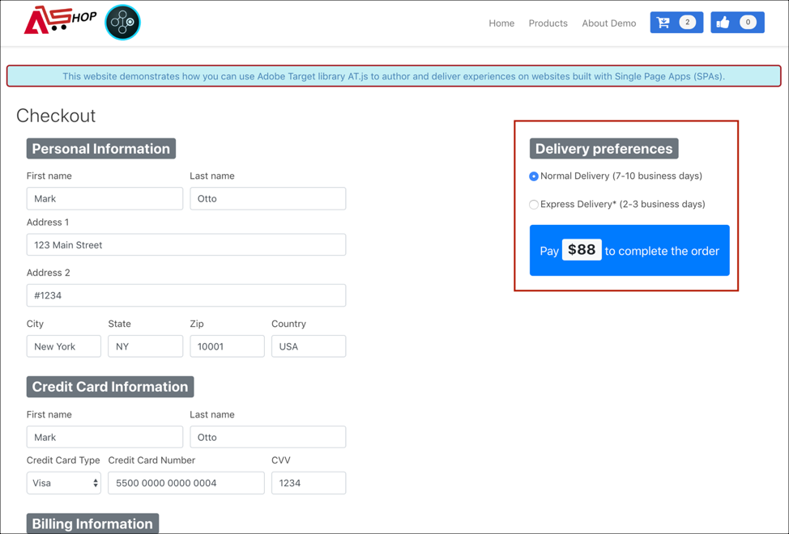
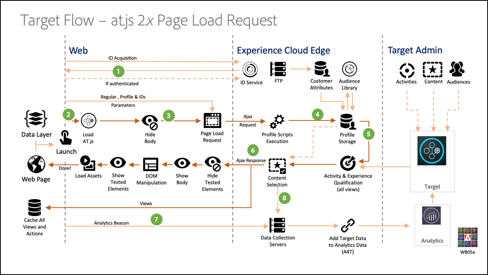

# 단일 페이지 애플리케이션 구현

기존의 웹 사이트는, 웹 사이트 디자인이 URL과 밀접하게 연결되어 있고 한 웹 페이지에서 다른 웹 페이지로 전환하려면 페이지를 로드해야 하는 다중 페이지 애플리케이션으로도 알려진 &quot;페이지-투-페이지&quot; 탐색 모델에서 작동했습니다. 단일 페이지 애플리케이션(SPA)과 같은 최신 웹 애플리케이션에서는 대신 종종 페이지 다시 로드와 무관한 브라우저 UI 렌더링을 촉진하는 모델을 채택합니다. 이러한 경험은 종종 스크롤, 클릭, 커서 움직임과 같은 고객 상호 작용에 의해 유발됩니다. 최신 웹의 패러다임이 발전함에 따라, 개인화 및 실험을 배포하기 위한 페이지 로드와 같은 종래의 일반 이벤트들의 관련성이 더 이상 작동하지 않고 있습니다.


at.js 2.x에서는 차세대 클라이언트측 기술에 대한 개인화를 실행하도록 기업을 지원하는 다양한 기능을 제공합니다. 이 버전은 SPA와 조화로운 상호 작용을 하도록 at.js를 개선하는 데 주력하고 있습니다.

at.js 2.x를 사용하면 이전 버전에서 사용할 수 없는 다음과 같은 몇 가지 이점이 있습니다.

* 페이지 로드 시 모든 오퍼를 캐시하여 여러 서버 호출을 하나의 서버 호출로 줄일 수 있습니다.
* 오퍼가 기존 서버 호출로 인해 초래되는 지연 없이 캐시를 통해 즉시 표시되므로 사이트에서 최종 사용자의 경험을 크게 향상시킬 수 있습니다.
* 간단한 1줄의 코드 및 일회용 개발자 설정으로 마케터가 SPA에서 VEC를 통해 A/B 및 경험 타깃팅(XT) 활동을 만들고 실행할 수 있도록 할 수 습니다.

## [!DNL Adobe Target] 보기 및 단일 페이지 애플리케이션

SPA용 [!DNL Adobe Target] VEC는 &quot;보기&quot;라는 새로운 개념을 사용합니다. 이 개념은 SPA 경험을 함께 구성하는 시각적 요소의 논리 그룹입니다. 따라서 SPA는 사용자 상호 작용을 기반으로 하여 URL 대신 보기를 통해 전환으로 간주할 수 있습니다. &quot;보기&quot;는 일반적으로 전체 사이트를 나타내거나 사이트 내의 그룹화된 시각적 요소를 나타낼 수 있습니다.

&quot;보기&quot;에 대해 더 설명하기 위해 React에 구현된 이러한 가상의 온라인 전자 상거래 사이트를 탐색하고 몇 가지 &quot;보기&quot; 예를 살펴보겠습니다. 아래 링크를 클릭하여 새 브라우저 탭에서 이 사이트를 엽니다.

**링크: [홈 사이트](https://target.enablementadobe.com/react/demo/#/)**


홈 사이트로 이동하면 사이트에서 판매되는 최신 제품과 부활절 판매를 홍보하는 영웅 이미지가 바로 표시됩니다. 이 경우 보기는 전체 홈 사이트로 정의할 수 있습니다. 아래 [!DNL Adobe Target] 보기 구현 섹션에서 이에 대해 자세히 설명하므로 기록해 두면 편리합니다.

**링크: [제품 사이트](https://target.enablementadobe.com/react/demo/#/products)**


이 기업이 판매하는 제품에 대한 관심이 높아짐에 따라 제품 링크를 클릭하기로 했습니다. 홈 사이트와 유사하게, 제품 사이트 전체를 보기로 정의할 수 있습니다. 이 보기의 이름을 `https://target.enablementadobe.com/react/demo/#/products)`의 경로 이름처럼 &quot;products&quot;로 지정할 수 있습니다.


이 섹션의 시작 부분에서 &quot;보기&quot;를 전체 사이트나 사이트에 있는 시각적 요소들의 그룹으로 정의했습니다. 위에 표시된 것처럼 사이트에 표시된 4개의 제품을 그룹화하고 &quot;보기&quot;로 간주할 수도 있습니다. 이 보기의 이름을 지정하려면 이름을 &quot;products&quot;로 지정할 수 있습니다.


추가 로드 단추를 클릭하여 사이트에서 더 많은 제품을 탐색하려 합니다. 이 경우에는 웹 사이트 URL은 변경되지 않습니다. 그러나 여기에서 &quot;보기&quot;는 위에 표시된 두 번째 제품 행만 나타낼 수 있습니다. 보기 이름은 &quot;PRODUCTS-PAGE-2&quot;이라고 할 수 있습니다.

**링크: [체크아웃](https://target.enablementadobe.com/react/demo/#/checkout)**


사이트에 표시된 일부 제품이 마음에 들어서 두 제품을 구매하기로 했습니다. 이제 체크아웃 사이트에서는 일반 배달이나 빠른 배달을 선택하는 선택 사항이 제공됩니다. &quot;보기&quot;는 사이트에서 임의의 시각적 요소 그룹일 수 있으므로 이 보기의 이름을 &quot;배달 환경 설정 보기&quot;로 지정할 수 있습니다.

또한 &quot;보기&quot; 개념은 이보다 훨씬 더 확장될 수 있습니다. 마케터가 선택된 배송 환경 설정에 따라 사이트에서 컨텐츠를 개인화하려는 경우 각 배달 환경 설정에 대해 &quot;보기&quot;를 만들 수 있습니다. 이 경우 일반 배달을 선택하면 보기의 이름을 &quot;일반 배달&quot;로 지정할 수 있습니다. 빠른 배달을 선택한 경우 보기의 이름을 &quot;빠른 배달&quot;로 지정할 수 있습니다.

이제 마케터는 빠른 배달을 선택했을 때 단추 색상을 두 배달 선택 사항 모두에 대해 파란색으로 유지하는 것과 대조적으로 색상을 파란색에서 빨간색으로 변경하는 것이 전환을 더 끌어올릴 수 있을지 여부를 확인하기 위해 A/B 테스트를 실행할 수 있습니다.

## [!DNL Adobe Target] 보기 구현

[!DNL Adobe Target] 보기에 대해 살펴보았으므로, 이제 [!DNL Target]에서 이 개념을 활용하여 마케터가 VEC를 통해 SPA에서 A/B 및 XT 테스트를 실행하도록 지원할 수 있습니다. 이렇게 하려면 일회용 개발자 설정이 필요합니다. 이 설정을 수행하는 단계를 살펴보겠습니다.

1. at.js 2.*x*.

   먼저 at.js 2를 설치해야 합니다.*x*. 이 at.js 버전은 SPA을 염두에 두고 개발되었습니다. 이전 at.js 버전은 [!DNL Adobe Target] 보기 및 SPA용 VEC를 지원하지 않습니다.

   at.js 다운로드 2.**[!UICONTROL Administration]** > **[!UICONTROL Implementation]**&#x200B;에 있는 [!DNL Adobe Target] UI를 통해 *x*&#x200B;합니다. at.js 2.*x*&#x200B;은(는) [!DNL Adobe Experience Platform]의 태그를 통해 배포할 수도 있습니다.

1. at.js 2.사이트에 *x* 함수, `[triggerView()](/help/dev/implement/client-side/atjs/atjs-functions/adobe-target-triggerview-atjs-2.md)`이(가) 있습니다.

   A/B 또는 XT 테스트를 실행할 SPA의 보기를 정의한 후 at.js 2를 구현합니다.매개 변수로 전달된 보기가 있는 *x* `triggerView()` 함수입니다. 이렇게 하면 마케터는 VEC를 사용하여 정의된 해당 보기에 대한 A/B 및 XT 테스트를 디자인하고 실행할 수 있습니다. 해당 보기에 대해 `triggerView()` 함수가 정의되지 않은 경우 VEC가 보기를 감지하지 않으므로 마케터는 VEC를 사용하여 A/B 및 XT 테스트를 디자인하고 실행할 수 없습니다.

   >[!NOTE]
   >
   >at.js에서 보기를 지원하려면 [viewsEnabled](/help/dev/implement/client-side/atjs/atjs-functions/targetglobalsettings.md#viewsenbabled)를 true로 설정해야 합니다. 그렇지 않으면 모든 보기 기능이 비활성화됩니다.

   **`adobe.target.triggerView(viewName, options)`**

   | 매개 변수 | 유형 | 필수? | 유효성 검사 | 설명 |
   | --- | --- | --- | --- | --- |
   | viewName | 문자열 | 예 | 1. 후행 공백이 없습니다.<br />2. 비워 둘 수 없습니다.<br />3. 보기 이름이 모든 페이지에 대해 고유해야 합니다.<br />4. **경고**: 보기 이름을 &#39;`/`&#39;로 시작하거나 종료해서는 안 됩니다. 일반적으로 고객은 URL 경로에서 보기 이름을 추출하기 때문입니다. 우리의 경우 &quot;홈&quot;과 &quot;`/home`&quot;이 다릅니다.<br />5. **경고**: `{page: true}` 선택 사항을 사용하여 동일한 보기를 여러 번 연속적으로 트리거할 수 없습니다. | 보기를 표현할 문자열 유형으로 모든 이름을 전달합니다. 이 보기 이름은 마케터가 작업을 만들고 A/B 및 XT 활동을 실행하는 VEC의 **[!UICONTROL Modifications]** 패널에 표시됩니다. |
   | options | 개체 | 아니오 |  |  |
   | options > page | 부울 | 아니오 |  | **TRUE**: 페이지의 기본값은 true입니다. `page=true`일 때 노출 수가 증가하면 Edge Server에 알림이 전송됩니다.<br />**FALSE**: `page=false`일 때 노출 수가 증가하면 알림이 전송되지 않습니다. 이 값은 오퍼가 있는 페이지에서 구성 요소를 다시 렌더링하려는 경우에만 사용해야 합니다. |

   이제 가상의 전자 상거래 SPA에 대해 React에서 `triggerView()` 함수를 호출하는 방법에 대한 몇 가지 사용 사례를 살펴보겠습니다.

   **링크: [홈 사이트](https://target.enablementadobe.com/react/demo/#/)**

   

   마케터는 전체 홈 사이트에서 A/B 테스트를 실행하려는 경우 &quot;홈&quot; 보기의 이름을 지정할 수 있습니다.

```
 function targetView() {
   var viewName = window.location.hash; // or use window.location.pathName if router works on path and not hash

   viewName = viewName || 'home'; // view name cannot be empty

   // Sanitize viewName to get rid of any trailing symbols derived from URL
   if (viewName.startsWith('#') || viewName.startsWith('/')) {
     viewName = viewName.substr(1);
   }

   // Validate if the Target Libraries are available on your website
   if (typeof adobe != 'undefined' && adobe.target && typeof adobe.target.triggerView === 'function') {
     adobe.target.triggerView(viewName);
   }
 }

 // react router v4
 const history = syncHistoryWithStore(createBrowserHistory(), store);
 history.listen(targetView);

 // react router v3
 <Router history={hashHistory} onUpdate={targetView} >
```

**링크: [제품 사이트](https://target.enablementadobe.com/react/demo/#/products)**

이제 좀 더 복잡한 예를 살펴보겠습니다. 마케터는 사용자가 [추가 로드] 단추를 클릭한 후 &quot;가격&quot; 레이블 색상을 빨간색으로 변경함으로써 제품의 두 번째 행을 개인화하려고 합니다.


```
 function targetView(viewName) {
   // Validate if the Target Libraries are available on your website
   if (typeof adobe != 'undefined' && adobe.target && typeof adobe.target.triggerView === 'function') {
     adobe.target.triggerView(viewName);
   }
 }

 class Products extends Component {
   render() {
     return (
       <button type="button" onClick={this.handleLoadMoreClicked}>Load more</button>
     );
   }

   handleLoadMoreClicked() {
     var page = this.state.page + 1; // assuming page number is derived from component's state
     this.setState({page: page});
     targetView('PRODUCTS-PAGE-' + page);
   }
 }
```

**링크: [체크아웃](https://target.enablementadobe.com/react/demo/#/checkout)**



마케터가 선택된 배송 환경 설정에 따라 사이트에서 컨텐츠를 개인화하려는 경우 각 배달 환경 설정에 대해 &quot;보기&quot;를 만들 수 있습니다. 이 경우 일반 배달을 선택하면 보기의 이름을 &quot;일반 배달&quot;로 지정할 수 있습니다. 빠른 배달을 선택한 경우 보기의 이름을 &quot;빠른 배달&quot;로 지정할 수 있습니다.

이제 마케터는 빠른 배달을 선택했을 때 단추 색상을 두 배달 선택 사항 모두에 대해 파란색으로 유지하는 것과 대조적으로 색상을 파란색에서 빨간색으로 변경하는 것이 전환을 더 끌어올릴 수 있을지 여부를 확인하기 위해 A/B 테스트를 실행할 수 있습니다.

```
 function targetView(viewName) {
   // Validate if the Target Libraries are available on your website
   if (typeof adobe != 'undefined' && adobe.target && typeof adobe.target.triggerView === 'function') {
     adobe.target.triggerView(viewName);
   }
 }

 class Checkout extends Component {
   render() {
     return (
       <div onChange={this.onDeliveryPreferenceChanged}>
         <label>
           <input type="radio" id="normal" name="deliveryPreference" value={"Normal Delivery"} defaultChecked={true}/>
           <span> Normal Delivery (7-10 business days)</span>
         </label>

         <label>
           <input type="radio" id="express" name="deliveryPreference" value={"Express Delivery"}/>
           <span> Express Delivery* (2-3 business days)</span>
         </label>
       </div>
     );
   }
   onDeliveryPreferenceChanged(evt) {
     var selectedPreferenceValue = evt.target.value;
     targetView(selectedPreferenceValue);
   }
 }
```

## at.js 2.x 시스템 다이어그램

다음 다이어그램은 보기가 있는 at.js 2.x의 워크플로를 이해하고 이를 통해 어떻게 SPA 통합이 향상되는지를 이해하는 데 도움이 됩니다. at.js 2.x에서 사용되는 개념의 도입을 보다 잘 이해하려면 [단일 페이지 애플리케이션 구현](/help/dev/implement/client-side/atjs/how-to-deployatjs/target-atjs-single-page-application.md)을 참조하십시오.



| 단계 | 세부 사항 |
| --- | --- |
| 1 | 사용자가 인증되면 호출에서 Experience Cloud ID를 반환합니다. 다른 호출은 고객 ID를 동기화합니다. |
| 2 | at.js 라이브러리는 동기식으로 로드되며 문서 본문을 숨깁니다.<br />at.js는 페이지에 구현된 코드 조각을 미리 숨기는 선택 사항을 사용하여 비동기식으로 로드할 수도 있습니다. |
| 3 | 모든 구성된 매개변수(MCID, SDID 및 고객 ID)를 포함하는 페이지 로드 요청이 이루어집니다. |
| 4 | 프로필 스크립트가 실행된 다음 프로필 저장소에 반영됩니다. 저장소는 대상 라이브러리의 적절한 대상(예: Adobe Analytics, Audience Management 등에서 공유되는 대상)을 요청합니다.<br />고객 속성은 묶음 프로세스를 통해 프로필 저장소로 전송됩니다. |
| 5 | [!DNL Target]에서는 URL 요청 매개변수 및 프로필 데이터를 기반으로 현재 페이지 및 미래 보기를 위해 방문자에게 반환할 활동 및 경험을 결정합니다. |
| 6 | 타기팅된 콘텐츠는 다시 페이지로 전송되며, 원할 경우 추가적인 개인화를 위한 프로필 값을 포함할 수 있습니다.<br />현재 페이지의 타깃팅된 콘텐츠는 기본 콘텐츠의 플리커 없이 가능한 한 빨리 나타납니다.<br />`triggerView()`를 통해 보기를 트리거할 때 추가적인 서버 호출 없이 즉시 적용할 수 있도록 브라우저에서 캐시된 SPA의 사용자 동작에 대한 결과로서 표시되는 보기를 위한 타깃팅된 콘텐츠입니다. |
| 7 | Analytics 데이터가 데이터 수집 서버로 전송됩니다. |
| 8 | 대상 데이터는 SDID를 통해 [!DNL Analytics] 데이터와 일치하고 [!DNL Analytics] 보고 저장소로 처리됩니다.그런 다음 [!DNL Target] (A4T) 보고서에 대한 [!DNL Analytics]을(를) 통해 <br />Analytics 데이터를 [!DNL Analytics]과(와) [!DNL Target] 모두에서 볼 수 있습니다. |

이제 SPA에서 `triggerView()`가 구현될 때 그곳이 어디든, 보기 및 작업은 캐시에서 검색되고 서버 호출 없이 사용자에게 표시됩니다. `triggerView()`는 또한 노출 수를 증가시키고 기록하기 위해 [!DNL Target] 백엔드에 알림을 요청합니다.


| 단계 | 세부 사항 |
| --- | --- |
| 1 | 보기를 렌더링하고 작업을 적용하여 시각적 요소를 수정하기 위해 SPA에서 `triggerView()`가 호출됩니다. |
| 2 | 보기용으로 타기팅된 콘텐츠를 캐시에서 읽습니다. |
| 3 | 타기팅된 콘텐츠는 기본 콘텐츠의 플리커 없이 가능한 한 빨리 나타납니다. |
| 4 | 활동 및 증분 지표에서 방문자를 계산하기 위해 알림 요청이 [!DNL Target] 프로필 스토어에 전송됩니다. |
| 5 | Analytics 데이터가 데이터 수집 서버로 전송됩니다. |
| 6 | 대상 데이터는 SDID를 통해 [!DNL Analytics] 데이터와 일치하고 [!DNL Analytics] 보고 저장소로 처리됩니다. 그런 다음 [!DNL Analytics] 데이터는 A4T 보고서를 통해 [!DNL Analytics] 및 [!DNL Target] 모두에서 볼 수 있습니다. |

## 단일 페이지 앱 시각적 경험 작성기

at.js 2.x를 설치하고 `triggerView()`를 사이트에 추가했으면 VEC를 사용하여 A/B 및 XT 활동을 실행합니다. 자세한 내용은 [SPA(단일 페이지 앱) 시각적 경험 작성기](https://experienceleague.adobe.com/docs/target/using/experiences/spa-visual-experience-composer.html)를 참조하십시오.

>[!NOTE]
>
>SPA용 VEC는 일반적인 웹 페이지에서 사용하는 것과 같은 VEC지만, 일부 추가 기능은 `triggerView()`가 구현된 단일 페이지 앱을 열 때 사용할 수 있습니다.

## TriggerView를 사용하여 A4T가 at.js 2.x 및 SPA에서 올바르게 작동하는지 확인

[Analytics for Target](https://experienceleague.adobe.com/docs/target/using/integrate/a4t/a4t.html)(A4T)이 at.js 2.x에서 올바르게 작동하려면 [!DNL Target] 요청과 [!DNL Analytics] 요청에서 동일한 SDID를 전송해야 합니다.

SPA와 관련된 우수 사례:

* 사용자 지정 이벤트를 사용하여 애플리케이션에서 흥미로운 사항이 발생했음을 알림
* 보기에서 렌더링을 시작하기 전에 사용자 지정 이벤트 실행
* 보기에서 렌더링을 마치면 사용자 지정 이벤트 실행

at.js 2.x는 새로운 API [triggerView()](/help/dev/implement/client-side/atjs/atjs-functions/adobe-target-triggerview-atjs-2.md) 함수를 추가했습니다. `triggerView()`를 사용하여 보기에서 렌더링을 시작한다고 at.js에 알립니다.

사용자 지정 이벤트, at.js 2.x 및 Analytics를 결합하는 방법을 살펴보려면 예제를 참조하십시오. 이 예는 HTML 페이지에 방문자 API, at.js 2.x, AppMeasurement가 순서대로 있다고 가정합니다.

다음의 사용자 지정 이벤트가 있다고 가정하겠습니다.

* `at-view-start` - 보기에서 렌더링을 시작할 때
* `at-view-end` - 보기에서 렌더링을 마칠 때

A4T가 at.js 2.x와 함께 작동하도록 하려면

보기 시작 처리기는 다음과 같이 표시되어야 합니다.

```jsx {line-numbers="true"}
document.addEventListener("at-view-start", function(e) {
  var visitor = Visitor.getInstance("<your Adobe Org ID>");
  
  visitor.resetState();
  adobe.target.triggerView("<view name>");
});
```

보기 종료 처리기는 다음과 같이 표시되어야 합니다.

```jsx {line-numbers="true"}
document.addEventListener("at-view-end", function(e) {
  // s - is the AppMeasurement tracker object
  s.t();
});
```

>[!NOTE]
>
>`at-view-start` 및 `at-view-end` 이벤트를 실행해야 합니다. 이러한 이벤트는 at.js 사용자 지정 이벤트의 일부가 아닙니다.

이러한 예에서 JavaScript 코드를 사용하지만 [Adobe Experience Platform](/help/dev/implement/client-side/atjs/how-to-deployatjs/implement-target-using-adobe-launch.md)의 태그와 같은 태그 관리자를 사용하는 경우 이 모든 작업을 단순화할 수 있습니다.

위의 단계를 수행하는 경우 SPA에 강력한 A4T 솔루션이 있어야 합니다.

## 구현 모범 사례

at.js 2.x API를 사용하면 여러 가지 방법으로 [!DNL Target] 구현을 사용자 지정할 수 있지만, 이 프로세스 동안 올바른 작업 순서를 따르는 것이 중요합니다.

다음 정보에서는 브라우저에서 처음으로 단일 페이지 애플리케이션을 로드할 때와 이후에 발생하는 모든 보기 변경 시 따라야 하는 작업 순서를 설명합니다.

### 초기 페이지 로드 작업 순서 {#order}

| 단계 | Action | 세부 사항 |
| --- | --- | --- |
| 1 | VisitorAPI JS 로드 | 이 라이브러리는 방문자에게 ECID를 할당합니다. 이 ID는 나중에 웹 페이지의 다른 Adobe 솔루션에서 사용됩니다. |
| 2 | at.js 2.x 로드 | at.js 2.x는 [!DNL Target] 요청 및 보기를 구현하는 데 사용하는 필요한 모든 API를 로드합니다. |
| 3 | [!DNL Target] 요청 실행 | 데이터 계층이 있는 경우 [!DNL Target] 요청을 실행하기 전에 [!DNL Target] (으)로 보내는 데 필요한 중요한 데이터를 로드하는 것이 좋습니다. `targetPageParams`을(를) 사용하여 타깃팅에 사용할 데이터를 포함할 수 있습니다.<P>[targetGlobalSettings](/help/dev/implement/client-side/atjs/atjs-functions/targetglobalsettings.md)에서 `pageLoadEnabled` 및 `viewsEnabled`을(를) true로 설정하면 at.js가 2단계에서 자동으로 모든 VEC [!DNL Target] 오퍼를 요청합니다.<P>페이지가 로드된 후 `getOffers`을(를) 사용하여 VEC 오퍼를 가져올 수도 있습니다. 이렇게 하려면 API 호출에 `execute>pageLoad` 및 `prefetch>views`이(가) 요청에 포함되어 있는지 확인하십시오. |
| 4 | `triggerView()` 호출 | 3단계에서 시작한 [!DNL Target] 요청은 페이지 로드 실행과 보기 모두에 대한 경험을 반환할 수 있으므로 [!DNL Target] 요청이 반환되고 캐시에 오퍼 적용을 완료한 후에 `triggerView()`이(가) 호출되는지 확인하십시오. 이 단계는 보기당 한 번만 실행해야 합니다. |
| 5 | [!DNL Analytics] 페이지 보기 비콘 호출 | 이 비콘은 데이터 결합을 위해 [!DNL Analytics] (으)로 3단계 및 4단계와 연결된 SDID를 보냅니다. |
| 6 | 추가 `triggerView({"page": false})` 호출 | 이것은 보기를 변경하지 않고 페이지의 특정 구성 요소를 잠재적으로 다시 렌더링할 수 있는 SPA 프레임워크의 선택적 단계입니다. 이러한 경우 SPA 프레임워크에서 구성 요소를 다시 렌더링한 후 [!DNL Target] 경험이 다시 적용되도록 하려면 이 API를 호출하는 것이 중요합니다. [!DNL Target] 경험이 SPA 보기에서 유지되도록 원하는 만큼 이 단계를 실행할 수 있습니다. |

### SPA 보기 변경에 대한 작업 순서(전체 페이지 다시 로드 없음)

| 단계 | Action | 세부 사항 |
| --- | --- | --- |
| 1 | `visitor.resetState()` 호출 | 이 API는 SDID가 로드될 때 새 보기에 대해 다시 생성되도록 합니다. |
| 2 | `getOffers()` API를 호출하여 캐시 업데이트 | 이 보기 변경이 현재 방문자에게 더 많은 [!DNL Target]개의 활동을 위한 자격을 부여하거나 활동에서 자격을 박탈할 가능성이 있는 경우 취해야 할 선택적 단계입니다. 이 시점에서 추가 타기팅 기능을 사용하도록 [!DNL Target]에 추가 데이터를 보내도록 선택할 수도 있습니다. |
| 3 | `triggerView()` 호출 | 2단계를 실행한 경우 [!DNL Target] 요청을 기다린 후 이 단계를 실행하기 전에 오퍼를 캐시에 적용해야 합니다. 이 단계는 보기당 한 번만 실행해야 합니다. |
| 4 | `triggerView()` 호출 | 2단계를 실행하지 않은 경우 1단계를 완료하는 즉시 이 단계를 실행할 수 있습니다. 2단계와 3단계를 실행한 경우에는 이 단계를 건너뜁니다. 이 단계는 보기당 한 번만 실행해야 합니다. |
| 5 | [!DNL Analytics] 페이지 보기 비콘 호출 | 이 비콘은 데이터 결합을 위해 2단계, 3단계 및 4단계와 연결된 SDID를 [!DNL Analytics]에 보냅니다. |
| 6 | 추가 `triggerView({"page": false})` 호출 | 이것은 보기를 변경하지 않고 페이지의 특정 구성 요소를 잠재적으로 다시 렌더링할 수 있는 SPA 프레임워크의 선택적 단계입니다. 이러한 경우 SPA 프레임워크에서 구성 요소를 다시 렌더링한 후 [!DNL Target] 경험이 다시 적용되도록 하려면 이 API를 호출하는 것이 중요합니다. [!DNL Target] 경험이 SPA 보기에서 유지되도록 원하는 만큼 이 단계를 실행할 수 있습니다. |

## 교육 비디오

다음 비디오에는 추가 정보가 포함되어 있습니다.

### at.js 2.x 작동 방식 이해

>[!VIDEO](https://video.tv.adobe.com/v/26250/?quality=12)

자세한 내용은 [at.js 2.x 작동 방식 이해](https://experienceleague.adobe.com/docs/target-learn/tutorials/implementation/understanding-how-atjs-20-works.html)를 참조하십시오.

### SPA에서 at.js 2.x 구현

>[!VIDEO](https://video.tv.adobe.com/v/26248/?quality=12)

자세한 내용은 [단일 페이지 애플리케이션(SPA)에서 Adobe Target의 at.js 2.x 구현](https://experienceleague.adobe.com/docs/target-learn/tutorials/experiences/use-the-visual-experience-composer-for-single-page-applications.html)을 참조하십시오.

### [!DNL Adobe Target]에서 SPA용 VEC 사용

>[!VIDEO](https://video.tv.adobe.com/v/26249/?quality=12)

자세한 내용은 [Adobe Target에서 SPA VEC(단일 페이지 애플리케이션용 시각적 경험 작성기 사용](https://experienceleague.adobe.com/docs/target-learn/tutorials/experiences/use-the-visual-experience-composer-for-single-page-applications.html)을 참조하십시오.
