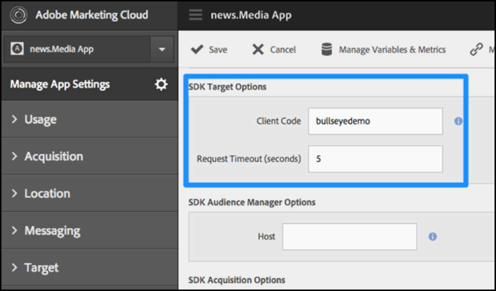

# SDK에서 [!DNL Target] 사용

앱에 [!UICONTROL Adobe Mobile Services SDK]을(를) 추가합니다.

>[!IMPORTANT]
>
>[!DNL Adobe Mobile] 버전 4를 지원합니다.*x* SDK는 2021년 8월 31일부로 종료되었으며 [!DNL Adobe Target] 모바일 사용자에게는 더 이상 권장되지 않습니다.
>
>[모바일 앱용 Adobe Experience Platform SDK](https://developer.adobe.com/client-sdks/documentation/){target=_blank}은(는) 모바일 앱에서 [!DNL Adobe Experience Cloud] 솔루션과 서비스를 제공하는 데 권장되는 솔루션입니다.

1. 앱에 Adobe Mobile Services SDK를 설치하지 않은 경우 Analytics 또는 Experience Cloud 자격 증명을 사용하고 [Mobile Services Adobe](https://mobilemarketing.adobe.com/) 웹 사이트에서 SDK를 다운로드합니다.

1. 앱에 [!DNL Adobe Mobile Services SDK]을(를) 추가합니다.

   [핵심 구현 및 라이프사이클](https://experienceleague.adobe.com/docs/mobile-services/ios/getting-started-ios/dev-qs.html)에서 지침을 찾을 수 있습니다.

1. 클라이언트 코드, 시간 제한을 추가하고, SSL을 활성화합니다. 

   Experience Cloud에서 Mobile Services를 열고 **[!UICONTROL Manage App Settings]** > **[!UICONTROL SDK Target Options]**(으)로 이동합니다.

   [!DNL Target] clientcode 및 시간 제한을 추가합니다. 클라이언트 코드는 계정 또는 회사에 고유합니다. 시간 제한은 [!DNL Target]이(가) 기본 콘텐츠를 표시하기 전에 응답을 기다리는 시간(초)입니다. Mobile Services Adobe의 앱 설정 관리 페이지에서 **[!UICONTROL Use HTTPS]** 옵션이 선택되어 있는지 확인하십시오. HTTPS를 사용하지 않는 경우 [!DNL Target] 서버를 사용하지 않으면 iOS 허용 목록에 추가하다+의 모든 호출이 차단됩니다.

   

1. 앱을 만들었거나 찾은 후에 앱 설정을 찾고 원하는 SDK를 다운로드합니다.

   

>[!WARNING]
>
> 모바일 마케팅 인터페이스에 액세스할 수 없는 경우 앱 코드의 구성 파일에서 직접 변경할 수 있습니다. 그러나 변경 사항이 사용자 인터페이스의 설정 페이지와 동기화되지 않습니다.
