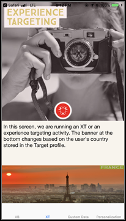

# [!DNL Target] 모바일 미리 보기

모바일 미리 보기 링크를 사용하여 모바일 앱 활동에 대한 간단한 종단 간 QA를 수행하고 특별한 테스트 장치 없이 장치를 사용하여 다양한 경험에 등록할 수 있습니다.

모바일 미리 보기 기능을 사용하면 모바일 앱 활동을 라이브로 시작하기 전에 완전히 테스트할 수 있습니다.

## 전제 조건

1. **지원되는 SDK 버전 사용:** 모바일 미리 보기 기능을 사용하려면 해당 버전의 를 다운로드하여 설치해야 합니다. [!DNL Adobe Mobile SDK] 을 클릭합니다.

   적절한 SDK를 다운로드하는 방법에 대한 지침은 [현재 SDK 버전](https://developer.adobe.com/client-sdks/documentation/current-sdk-versions/){target=_blank} 다음에서 *[!DNL Adobe Experience Platform Mobile SDK]* 설명서를 참조하십시오.

1. **URL 체계 설정:** 미리 보기 링크는 URL 체계를 사용하여 앱을 엽니다. 미리 보기에 대한 고유한 URL 체계를 지정합니다.

   자세한 내용은 [시각적 미리보기](https://developer.adobe.com/client-sdks/documentation/adobe-target/#visual-preview){target=_blank} 위치: *데이터 연결 UI에서 Target 확장 구성* 다음에서 *[!DNL Mobile SDK]* 설명서를 참조하십시오.

   다음 링크에는 추가 정보가 포함되어 있습니다.

   * **iOs**: iOS의 URL 체계 설정에 대한 자세한 내용은 [앱에 대한 사용자 지정 URL 체계 정의](https://developer.apple.com/documentation/xcode/defining-a-custom-url-scheme-for-your-app){target=_blank} 다음에 있음 *Apple 개발자* 웹 사이트입니다.
   * **Android**: Android용 URL 체계 설정에 대한 자세한 내용은 [앱 콘텐츠에 대한 딥링크 만들기](https://developer.android.com/training/app-links/deep-linking){target=_blank} 다음에 있음 *Android 개발자* 웹 사이트입니다.

1. **다음을 설정합니다. `collectLaunchInfo` API(i0S만 해당)**

   자세한 내용은 [시각적 미리보기](https://developer.adobe.com/client-sdks/documentation/adobe-target/#visual-preview){target=_blank} 위치: *데이터 연결 UI에서 Target 확장 구성* 다음에서 *[!DNL Mobile SDK]* 설명서를 참조하십시오.

## 미리 보기 링크 생성

1. 다음에서 [!DNL Target] UI에서 **[!UICONTROL 추가 옵션]** 아이콘(수직 줄임표)을 클릭한 다음 을 선택합니다 **[!UICONTROL 모바일 미리 보기 링크 만들기]**.

   

1. 미리 보려는 활동을 선택한 다음 을 클릭합니다 **[!UICONTROL 모바일 미리 보기 링크 생성]**.

   >[!NOTE]
   >
   >양식 기반만 선택할 수 있습니다. [!UICONTROL A/B 테스트] 및 [!UICONTROL 경험 타기팅] (XT) 활동.

   

1. 앱의 URL 체계를 지정합니다.

   이러한 URL 체계는 iOS 또는 Android 앱에 있는 것과 동일해야 합니다. 필요한 경우 iOS 및 Android에 대해 이 프로세스를 별도로 반복합니다.

   

1. **[!UICONTROL 모바일 미리 보기 링크 생성]**&#x200B;을 클릭한 다음, 링크를 복사합니다.

   

## 장치에서 미리 보기

앱이 설치된 장치의 모바일 브라우저에서 링크를 엽니다. 이 앱은에서 다운로드한 프로덕션 앱일 수 있습니다. [!DNL Apple App Store] 또는 [!DNL Google Play Store]. 앱이 특수 빌드일 필요는 없습니다. 활성 미리 보기 링크가 있는 경우 장치에서 경험을 볼 수 있습니다.

1. 모바일 브라우저에서 링크를 엽니다.

   의 이전 섹션에서 복사한 링크를 공유합니다. [!DNL Target] 텍스트, 이메일 또는 [!DNL Slack].

   |||

   앱이 열리고 [!DNL Target] [!UICONTROL 모바일 미리 보기 모드].

1. 표시하려는 경험의 조합을 선택한 다음 **[!UICONTROL 경험 실행을 클릭합니다]**.

   ||||
||||

## 제한

* **[!UICONTROL 경험 실행]** 단추를 클릭한 후에 새 컨텐츠가 표시되도록 보기를 다시 로드해야 합니다. 가장 쉬운 방법은 다른 화면으로 전환한 다음, 변경이 발생할 것으로 예상되는 화면으로 돌아가는 것입니다.
* API-19(KitKat) 이전의 Android 버전에서는 모바일 미리 보기가 지원되지 않습니다.
