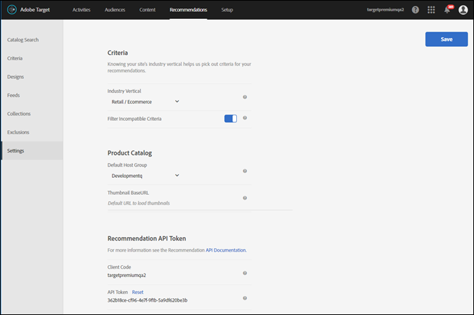

# 계획 및 구현 [!UICONTROL Recommendations]

계획 및 구현에 도움이 되는 정보 [!DNL Adobe Target Recommendations].

>[!NOTE]
>
>이 문서 외에도 [Adobe Target 비즈니스 실무자 안내서](https://experienceleague.adobe.com/docs/target/using/target-home.html?lang=ko_KR){target=_blank} contains in-depth information about [Target Recommendations](https://experienceleague.adobe.com/docs/target/using/recommendations/recommendations.html){target=_blank}.

첫 번째 을(를) 설정하기 전에 [!UICONTROL Recommendations] 의 활동 [!DNL Adobe Target], 다음 단계를 완료합니다.

1. [구현 [!UICONTROL Target]](#implement-target) 사용자 행동을 포착하고 권장 사항을 전달하는 데 사용할 웹 및 모바일 앱 표면에서.
1. [설정 [!UICONTROL Recommendations] 카탈로그](#set-up-your-recommendations-catalog) 사용자에게 추천할 제품 또는 콘텐츠 중
1. [동작 정보 및 컨텍스트 전달](#pass-behavioral-information-and-context) 끝 [!DNL Target Recommendations] 개인화된 추천을 제공할 수 있도록 해 줍니다.
1. [전역 제외 구성](#configure-global-exclusions).
1. [구성 [!UICONTROL Recommendations] 설정](#configure-recommendations-settings).
1. (선택 사항) [관리 [!UICONTROL Recommendations] 관리 API 사용](#administer-recommendations-using-admin-apis).

## 1. 구현 [!UICONTROL Target]

[!DNL Target Recommendations] 를 사용하려면 Adobe Experience Platform Web SDK 또는 at.js 0.9.2 이상 버전을 구현해야 합니다. 다음을 참조하십시오. [[!UICONTROL Target] 클라이언트측 구현 안내서](../client-side/overview.md) 추가 정보.

## 2. 설정 [!UICONTROL Recommendations] 카탈로그

고품질 추천을 제공하기 위해 [!UICONTROL Target] 추천할 제품 또는 콘텐츠에 대해 알고 있어야 합니다. 카탈로그에는 일반적으로 권장 항목에 대한 세 가지 유형의 정보가 포함됩니다. 영화를 추천한다고 가정해 봅시다. 다음을 포함합니다.

1. 추천을 받는 사용자에게 표시하려는 데이터. 예를 들어 동영상 이름과 동영상 포스터 축소판 이미지의 URL을 표시할 수 있습니다.
1. 마케팅 및 판매 계획 관리에 유용한 데이터. 예를 들어 NC-17 영화를 추천하지 않도록 영화 등급을 표시할 수 있습니다.
1. 항목과 다른 항목의 유사성을 결정하는 데 유용한 데이터. 예를 들어 영화 장르와 영화 감독을 표시할 수 있습니다.

[!UICONTROL Target] 은 카탈로그를 채우기 위한 여러 통합 옵션을 제공합니다. 이러한 옵션을 조합하여 사용하여 카탈로그의 여러 항목을 업데이트하거나 다른 빈도의 여러 항목 속성을 업데이트할 수 있습니다.

| 방법 | 정의 | 사용하는 경우 | 추가 정보 |
| --- | --- | --- | --- |
| 카탈로그 피드 | 매일 업로드하고 수집할 피드(CSV, Google 제품 XML 또는 Analytics 제품 분류)를 예약합니다. | 한 번에 여러 항목에 대한 정보를 보냅니다. 자주 변경되지 않는 정보를 보내는 경우 | 다음을 참조하십시오 [피드](https://experienceleague.adobe.com/docs/target/using/recommendations/entities/feeds.html). |
| 엔티티 API | API를 호출하여 단일 항목에 대한 최신 업데이트를 보냅니다. | 한 번에 한 항목에 대해 발생하는 업데이트 전송 자주 변경되는 정보(예: 가격, 재고/재고 수준) 전송 | 다음을 참조하십시오. [엔티티 API 개발자 설명서](https://developers.adobetarget.com/api/recommendations/#tag/Entities). |
| 페이지에서 업데이트 전달 | 페이지에서 JavaScript를 사용하거나 배달 API를 사용하여 단일 항목에 대한 최신 업데이트를 보냅니다. | 한 번에 한 항목에 대해 발생하는 업데이트 전송 자주 변경되는 정보(예: 가격, 재고/재고 수준) 전송 | 다음을 참조하십시오 [항목 보기/제품 페이지](#item-views-or-product-pages) 아래요. |

대부분의 고객은 하나 이상의 피드를 구현해야 합니다. 그런 다음 엔티티 API 또는 페이지 위 방법을 사용하여 자주 변경되는 속성 또는 항목에 대한 업데이트로 피드를 보완하도록 선택할 수 있습니다.

## 3. 행동 정보 및 컨텍스트 전달

전달해야 하는 동작 정보 및 컨텍스트 [!UICONTROL Target] 은 방문자가 수행하는 작업에 따라 다르며, 이 작업은 종종 방문자가 상호 작용하는 페이지 유형과 연관되어 있습니다.

### 항목 보기 또는 제품 페이지

제품 세부 사항 페이지와 같이 방문자가 단일 항목을 보고 있는 페이지에서는 방문자가 보고 있는 항목의 ID를 전달해야 합니다. 또한 방문자가 보고 있는 항목의 가장 세부적인 카테고리를 전달하여 현재 카테고리에 대한 필터링 권장 사항을 허용해야 합니다.

제품 페이지 자체에서 빠르게 변화하는 특정 속성을 전달할 수도 있습니다. 예를 들어 ( )를 전달할 수 있습니다.`value`) 및 재고/재고 수준.

#### 합격 가격 및 재고

```js {line-numbers="true"}
<script type="text/javascript">
function targetPageParams() { 
   return { 
      "entity": { 
         "id": "32323", 
         "categoryId": "running-shoes", 
         "value": 119.99, 
         "inventory": 329 
      } 
   } 
}
</script>
```

### 범주 보기/범주 페이지

카테고리 페이지에서는 해당 카테고리 내의 제품 또는 콘텐츠로 권장 사항을 제한할 수 있습니다. 이렇게 하려면 현재 표시된 카테고리의 ID를 전달해야 합니다.

#### 현재 범주 전달

```js {line-numbers="true"}
function targetPageParams() { 
   return { 
      "entity": { 
         "categoryId": "running-shoes" 
      } 
   } 
}
```

### 장바구니 추가/장바구니 보기/체크아웃 페이지

장바구니 페이지에서는 방문자의 현재 장바구니의 콘텐츠에 따라 항목을 추천할 수 있습니다. 이렇게 하려면 특수 매개 변수를 사용하여 방문자의 현재 장바구니에 있는 모든 항목의 ID를 전달합니다 `cartIds`.

#### 현재 장바구니에 있는 항목 전달

```js {line-numbers="true"}
function targetPageParams() {
   return {
      "cartIds": "352,223,23432,432,553"
      }
}
```

장바구니 기반 권장 사항에 대한 자세한 내용은 [장바구니 기반](https://experienceleague.adobe.com/docs/target/using/recommendations/criteria/base-the-recommendation-on-a-recommendation-key.html?lang=en#cart-based) 다음에서 *[!DNL Adobe Target]비즈니스 실무자 안내서*.

### 방문자 장바구니에 이미 있는 항목 제외

사이트의 페이지에서 일부 항목을 권장 사항에서 제외할 수 있습니다. 예를 들어 방문자의 현재 장바구니에 이미 있는 항목을 추천하지 않을 수 있습니다. 이렇게 하려면 특수 매개 변수를 사용하여 제외할 모든 항목의 ID를 전달합니다 `excludedIds`.

#### 제외할 항목 전달

```js {line-numbers="true"}
function targetPageParams() {
   return {
      "excludedIds": "352,223,23432,432,553"
      }
}
```

### 구매/주문 확인 페이지

구매 이벤트가 발생하면 구매한 항목의 ID를 전달합니다. 다음을 참조하십시오 [전환 추적](../client-side/atjs/how-to-deployatjs/implement-target-without-a-tag-manager.md#track-conversions) 다음에서 [at.js 배포 방법 > 구현 [!UICONTROL Target] 태그 관리자 없음](../client-side/atjs/how-to-deployatjs/implement-target-without-a-tag-manager.md) 기사.

## 4. 전역 제외 구성

방문자에게 추천하지 않으려는 글로벌 수준의 항목을 제외합니다. 다음을 참조하십시오 [제외](https://experienceleague.adobe.com/docs/target/using/recommendations/entities/exclusions.html) 다음에서 *[!DNL Adobe Target]비즈니스 실무자 안내서*.

## 5. 구성 [!UICONTROL Recommendations] 설정

설정을 사용하여 [!UICONTROL 권장 사항] 구현을 관리하십시오.

**[!UICONTROL 권장 사항 설정]** 선택 사항에 액세스하려면 [!DNL Adobe Experience Cloud]에서 Target을 연 다음, **[!UICONTROL 권장 사항]** > **[!UICONTROL 설정]**&#x200B;을 클릭하십시오.



다음 옵션을 사용할 수 있습니다.

| 설정 | 설명 |
|--- |--- |
| 사용자 지정 글로벌 mbox | (선택 사항) [!UICONTROL Target] 활동을 제공하는 데 사용되는 사용자 지정 글로벌 mbox를 지정합니다. 기본적으로 [!UICONTROL Target]에 사용되는 글로벌 mbox는 [!UICONTROL 권장 사항]에 사용됩니다.<P>참고: 이 옵션은 [!UICONTROL Target] **[!UICONTROL 관리]** 페이지를 가리키도록 업데이트하는 중입니다. 열기 [!UICONTROL Target]을 클릭한 다음 을 클릭합니다 **[!UICONTROL 관리]** > **[!UICONTROL 시각적 경험 작성기]**. |
| 업계 카테고리 | 업계 카테고리는 권장 사항 기준을 분류하는 데 사용됩니다. 이 정보는 팀원이 장바구니 페이지나 미디어 페이지에 가장 적합한 기준과 같이 특정 페이지에 적합한 기준을 찾는 데 도움이 됩니다. |
| 호환되지 않는 기준 필터링 | 선택한 페이지가 필수 데이터를 전달하는 기준만 표시하려면 이 선택 사항을 사용하십시오. 모든 기준이 모든 페이지에서 올바르게 실행되는 것은 아닙니다. 페이지 또는 mbox를 전달해야 합니다. `entity.id` 또는 `entity.categoryId` 호환될 현재 항목/현재 카테고리에 대한 권장 사항입니다. 일반적으로 호환 가능한 기준만 표시하는 것이 가장 좋습니다. 그러나 호환되지 않는 기준을 활동에 사용할 수 있게 하려면 이 선택 사항을 선택 취소하십시오.<P>태그 관리 솔루션을 사용하는 경우에는 이 선택 사항을 비활성화하는 것이 좋습니다.<P>이 선택 사항에 대한 자세한 내용은 [[!UICONTROL Recommendations] FAQ](https://experienceleague.adobe.com/docs/target/using/recommendations/recommendations-faq/recommendations-faq.html) 다음에서 *[!DNL Adobe Target]비즈니스 실무자 안내서*. |
| 기본 호스트 그룹 | 기본 호스트 그룹을 선택합니다.<P>호스트 그룹을 사용하여 카탈로그에 있는 사용 가능한 항목을 다양한 용도로 구분할 수 있습니다. 예를 들어 개발 및 프로덕션 환경, 다양한 브랜드 또는 다양한 지역용으로 호스트 그룹을 사용할 수 있습니다. 기본적으로 카탈로그 검색, 컬렉션 및 제외의 미리 보기 결과는 기본 호스트 그룹을 기반으로 합니다. (환경 필터를 사용하여 다른 결과를 미리 볼 호스트 그룹을 선택할 수도 있습니다.) 기본적으로 항목을 만들거나 업데이트할 때 환경 ID를 지정하지 않는 한, 새로 추가된 항목은 모든 호스트 그룹에서 사용할 수 있습니다. 전달되는 권장 사항은 요청에 지정된 호스트 그룹에 따라 다릅니다.<P>제품이 보이지 않는다면 올바른 호스트 그룹을 사용하고 있는지 확인하십시오. 예를 들어, 스테이징 환경을 사용하도록 권장 사항을 설정하고 호스트 그룹을 스테이징으로 설정하는 경우, 제품을 표시할 스테이징 환경에서 컬렉션을 다시 만들어야 합니다. 각 환경에서 사용 가능한 제품을 확인하려면 각 환경에서 카탈로그 검색을 사용하십시오. 의 콘텐츠를 미리 볼 수도 있습니다. [!UICONTROL Recommendations] 선택한 환경(호스트 그룹)에 대한 컬렉션 및 제외<P>**참고:**  선택한 환경을 변경한 후 검색을 클릭하여 반환된 결과를 업데이트해야 합니다.<P> **[!UICONTROL 환경 필터는 Target UI의 다음 위치에서 사용할 수 있습니다.]**<ul><li>카탈로그 검색(**[!UICONTROL Recommendations]** > **[!UICONTROL 카탈로그 검색]**)</li><li>컬렉션 만들기 대화 상자(**[!UICONTROL Recommendations]** > **[!UICONTROL 컬렉션]** > **[!UICONTROL 새로 만들기]**)</li><li>컬렉션 업데이트 대화 상자(**[!UICONTROL Recommendations]** > **[!UICONTROL 컬렉션]** > **[!UICONTROL 편집]**)</li><li>제외 만들기 대화 상자(**[!UICONTROL Recommendations]** > **[!UICONTROL 제외]** > **[!UICONTROL 새로 만들기]**)</li><li>제외 업데이트 대화 상자(**[!UICONTROL Recommendations]** > **[!UICONTROL 제외]** > **[!UICONTROL 편집]**)</li></ul>자세한 내용은 [호스트](https://experienceleague.adobe.com/docs/target/using/administer/hosts.html) 다음에서 *[!DNL Adobe Target]비즈니스 실무자 안내서*. |
| 썸네일 기본 URL | 제품 카탈로그용의 기본 URL을 설정하면 썸네일 URL을 전달할 때, 제품의 썸네일을 지정할 때 상대 URL을 사용할 수 있습니다.<P>예:<P>`"entity.thumbnailURL=/Images/Homepage/product1.jpg"`<P>썸네일 기본 URL에 상대적인 URL을 설정합니다. |
| [!UICONTROL Recommendations API 토큰] | 에서 이 토큰 사용 [!UICONTROL Recommendations] 다운로드 API와 같은 API 호출. |

## 6. (선택 사항) 관리 [!UICONTROL Recommendations] 관리 API 사용

다음을 참조하십시오. [사용 [!UICONTROL Recommendations] API](../../before-administer/recs-api/overview.md) 구성 및 사용 방법에 대해 알아보는 실습 안내서 [!UICONTROL Target] 에 대한 관리 및 게재 API [!UICONTROL Recommendations].
