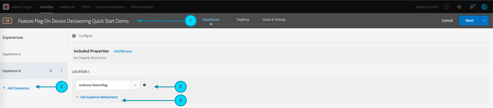
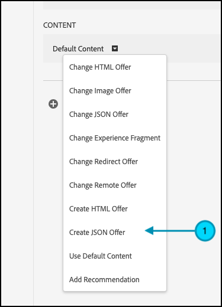
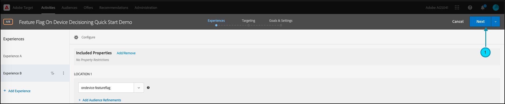

# 시작하기 [!DNL Target] SDK

시작하고 실행하기 위해 첫 번째 항목을 만드는 것이 좋습니다 [온디바이스 의사 결정](../on-device-decisioning/overview.md) 기능 플래그 활동을 선택한 언어로 표시:

* Node.js
* Java
* .NET
* Python

## 단계 요약

1. 조직에 대해 온디바이스 의사 결정 활성화
1. SDK 설치
1. SDK 초기화
1. 에서 기능 플래그 설정 [!DNL Adobe Target] [!UICONTROL A/B 테스트] 활동
1. 응용 프로그램에서 기능 구현 및 렌더링
1. 애플리케이션의 이벤트에 대한 추적 구현
1. 활성화 [!UICONTROL A/B 테스트] 활동

## 1. 조직에 대해 온디바이스 의사 결정 사용

디바이스에서 의사 결정을 활성화하면 [!UICONTROL A/B 테스트] 활동이 거의 0에 가까운 지연 시간에 실행됩니다. 이 기능을 사용하려면 다음 위치로 이동하십시오. **[!UICONTROL 관리]** > **[!UICONTROL 구현]** > **[!UICONTROL 계정 세부 정보]** 및 활성화 **[!UICONTROL 온디바이스 의사 결정]** 토글.


>[!NOTE]
>
>다음을 보유해야 합니다. **[!UICONTROL 관리자]** 또는 **[!UICONTROL 승인자]** [사용자 역할](https://experienceleague.adobe.com/docs/target/using/administer/manage-users/user-management.html) 을(를) 활성화 또는 비활성화하려면 **[!UICONTROL 온디바이스 의사 결정]** 토글.

활성화 후 **[!UICONTROL 온디바이스 의사 결정]** 전환, [!DNL Adobe Target] 생성 시작 [규칙 아티팩트](../on-device-decisioning/rule-artifact-overview.md) 클라이언트.

## 2. SDK 설치

Node.js, Java 및 Python의 경우 터미널의 프로젝트 디렉터리에서 다음 명령을 실행합니다. .NET의 경우 다음 방법으로 종속으로 추가합니다. [nuGet에서 설치](https://www.nuget.org/packages/Adobe.Target.Client).

>[!BEGINTABS]

>[!TAB Node.js (NPM)]

```js {line-numbers="true"}
npm i @adobe/target-nodejs-sdk -P
```

>[!TAB Java(Maven)]

```javascript {line-numbers="true"}
<dependency>
   <groupId>com.adobe.target</groupId>
   <artifactId>java-sdk</artifactId>
   <version>2.0</version>
</dependency>
```

>[!TAB .NET (Bash)]

```bash {line-numbers="true"}
dotnet add package Adobe.Target.Client
```

>[!TAB Python(pip)]

```python {line-numbers="true"}
pip install target-python-sdk
```

>[!ENDTABS]

## 3. SDK 초기화

규칙 아티팩트는 SDK 초기화 단계 중에 다운로드됩니다. 초기화 단계를 사용자 정의하여 아티팩트가 다운로드되고 사용되는 방법을 결정할 수 있습니다.

>[!BEGINTABS]

>[!TAB Node.js]

```js {line-numbers="true"}
const TargetClient = require("@adobe/target-nodejs-sdk");

const CONFIG = {
   client: "<your target client code>",
   organizationId: "your EC org id",
   decisioningMethod: "on-device",
   events: {
      clientReady: targetClientReady
      }
};

const tClient = TargetClient.create(CONFIG);

function targetClientReady() {
   //Adobe Target SDK has now downloaded the JSON artifact locally, which contains the activity details.
   //We will see how to use the artifact here very soon.
}
```

>[!TAB Java(Maven)]

```javascript {line-numbers="true"}
ClientConfig config = ClientConfig.builder()
   .client("testClient")
   .organizationId("ABCDEF012345677890ABCDEF0@AdobeOrg")
   .build();
TargetClient targetClient = TargetClient.create(config);
```

>[!TAB .NET (C#)]

```csharp {line-numbers="true"}
var targetClientConfig = new TargetClientConfig.Builder("testClient", "ABCDEF012345677890ABCDEF0@AdobeOrg")
   .Build();
this.targetClient.Initialize(targetClientConfig);
```

>[!TAB Python]

```python {line-numbers="true"}
from target_python_sdk import TargetClient

def target_client_ready():
   # Adobe Target SDK has now downloaded the JSON artifact locally, which contains the activity details.
   # We will see how to use the artifact here very soon.

CONFIG = {
   "client": "<your target client code>",
   "organization_id": "your EC org id",
   "decisioning_method": "on-device",
   "events": {
      "client_ready": target_client_ready
   }
}

target_client = TargetClient.create(CONFIG)
```

>[!ENDTABS]

## 4. 기능 플래그를 설정합니다. [!DNL Adobe Target] [!UICONTROL A/B 테스트] 활동

1. 위치 [!DNL Target]로 이동한 다음 **[!UICONTROL 활동]** 페이지를 선택한 다음 **[!UICONTROL 활동 만들기]** > **[!UICONTROL A/B 테스트]**.

   

1. 다음에서 **[!UICONTROL A/B 테스트 활동 만들기]** 모달에서 기본 웹 옵션을 선택한 상태로 둡니다(1). 다음을 선택합니다. **[!UICONTROL 양식]** 경험 작성기 (2)로서 **[!UICONTROL 기본 작업 영역]** 포함 **[!UICONTROL 속성 제한 없음]**(3) 을 클릭한 다음 **[!UICONTROL 다음]** (4)

   

1. 다음에서 **[!UICONTROL 경험]** 활동 만들기 단계에서 활동(1)의 이름을 입력하고 를 클릭하여 두 번째 경험인 경험 B를 추가합니다. **[!UICONTROL 경험 추가]** (2) 선택한 위치 이름을 입력합니다(3). 예를 들어, `ondevice-featureflag` 또는 `homepage-addtocart-featureflag` 기능 플래그 테스트 대상을 나타내는 위치 이름입니다.  아래 표시된 예에서는 `ondevice-featureflag` 은 경험 B에 대해 정의된 위치입니다. 필요에 따라 대상 세분화(4)를 추가하여 활동에 자격을 제한할 수 있습니다.

   

1. 다음에서 **[!UICONTROL 콘텐츠]** 동일한 페이지의 섹션에서 다음을 선택합니다. **[!UICONTROL JSON 오퍼 만들기]** (1)을 클릭합니다.

   

1. 다음에서 **[!UICONTROL JSON 데이터]** 표시되는 텍스트 상자에 유효한 JSON 개체(2)를 사용하여 각 경험(1)에 대한 기능 플래그 변수를 입력합니다.

   경험 A에 대한 기능 플래그 변수를 입력합니다.

   

   **(위의 경험 A에 대한 샘플 JSON)**

   ```json {line-numbers="true"}
   {
      "enabled" : true,
      "flag" : "expA"
   }
   ```

   경험 B에 대한 기능 플래그 변수를 입력합니다.

   

   **(위의 경험 B에 대한 샘플 JSON)**

   ```json {line-numbers="true"}
   {
      "enabled" : true,
      "flag" : "expB"
   }
   ```

1. 클릭 **[!UICONTROL 다음]** (1) (으)로 이동 **[!UICONTROL 타겟팅]** 활동 만들기 단계입니다.

   

1. 다음에서 **[!UICONTROL 타겟팅]** 아래 표시된 단계 예와 같이, 단순성을 위해 대상 타깃팅(2)은 모든 방문자의 기본 세트에 유지됩니다. 즉, 활동이 타깃팅되지 않습니다. 그러나 참고 Adobe은 항상 프로덕션 활동의 대상을 타기팅하는 것을 권장합니다. 클릭 **[!UICONTROL 다음]** (3) (으)로 이동 **[!UICONTROL 목표 및 설정]** 활동 만들기 단계입니다.

   

1. 다음에서 **[!UICONTROL 목표 및 설정]** 단계, 설정 **[!UICONTROL 보고 소스]** 끝 **[!UICONTROL Adobe Target]** (1) 다음을 정의합니다. **[!UICONTROL 목표 지표]** 다음으로: **[!UICONTROL 전환]**&#x200B;를 클릭하고 사이트의 전환 지표를 기반으로 세부 사항을 지정합니다(2). 클릭 **[!UICONTROL 저장 및 닫기]** (3) 활동을 저장합니다.

   

## 5. 응용 프로그램에서 기능 구현 및 렌더링

에서 기능 플래그 변수를 설정한 후 [!DNL Target]를 클릭하고 애플리케이션 코드를 수정하여 이를 사용합니다. 예를 들어 애플리케이션에서 기능 플래그를 가져온 후 이를 사용하여 기능을 활성화하고 방문자가 자격을 부여받은 경험을 렌더링할 수 있습니다.

>[!BEGINTABS]

>[!TAB Node.js]

```js {line-numbers="true"}
//... Code removed for brevity
​
let featureFlags = {};
​
function targetClientReady() {
   tClient.getAttributes(["ondevice-featureflag"]).then(function(response) {
      const featureFlags = response.asObject("ondevice-featureflag");
      if(featureFlags.enabled && featureFlags.flag !== "expA") { //Assuming "expA" is control
         console.log("Render alternate experience" + featureFlags.flag);
      }
      else {
         console.log("Render default experience");
      }
   });
}
```

>[!TAB Java(Maven)]

```javascript {line-numbers="true"}
MboxRequest mbox = new MboxRequest().name("ondevice-featureflag").index(0);
TargetDeliveryRequest request = TargetDeliveryRequest.builder()
   .context(new Context().channel(ChannelType.WEB))
   .execute(new ExecuteRequest().mboxes(Arrays.asList(mbox)))
   .build();
Attributes attributes = targetClient.getAttributes(request, "ondevice-featureflag");
String flag = attributes.getString("ondevice-featureflag", "flag");
```

>[!TAB .NET (C#)]

```csharp {line-numbers="true"}
var mbox = new MboxRequest(index: 0, name: "ondevice-featureflag");
var deliveryRequest = new TargetDeliveryRequest.Builder()
   .SetContext(new Context(ChannelType.Web))
   .SetExecute(new ExecuteRequest(mboxes: new List<MboxRequest> { mbox }))
   .Build();
var attributes = targetClient.GetAttributes(request, "ondevice-featureflag");
var flag = attributes.GetString("ondevice-featureflag", "flag");
```

>[!TAB Python]

```python {line-numbers="true"}
# ... Code removed for brevity

feature_flags = {}

def target_client_ready():
   attribute_provider = target_client.get_attributes(["ondevice-featureflag"])
   feature_flags = attribute_provider.as_object(mbox_name="ondevice-featureflag")
   if feature_flags.get("enabled") and feature_flags.get("flag") != "expA": # Assuming "expA" is control
      print("Render alternate experience {}".format(feature_flags.get("flag")))
   else:
      print("Render default experience")
```

>[!ENDTABS]

## 6. 애플리케이션의 이벤트에 대한 추가 추적 구현

선택적으로 sendNotification() 함수를 사용하여 전환 추적을 위한 추가 이벤트를 보낼 수 있습니다.

>[!BEGINTABS]

>[!TAB Node.js]

```js {line-numbers="true"}
//... Code removed for brevity
​
//When a conversion happens
TargetClient.sendNotifications({
   targetCookie,
   "request" : {
      "notifications" : [
      {
         type: "display",
         timestamp : Date.now(),
         id: "conversion",
         mbox : {
            name : "orderConfirm"
         },
         order : {
            id: "BR9389",
            total : 98.93,
            purchasedProductIds : ["J9393", "3DJJ3"]
         }
      }
      ]
   }
})
```

>[!TAB Java(Maven)]

```javascript {line-numbers="true"}
Notification notification = new Notification();
notification.setId("conversion");
notification.setImpressionId(UUID.randomUUID().toString());
notification.setType(MetricType.DISPLAY);
notification.setTimestamp(System.currentTimeMillis());
Order order = new Order("BR9389");
order.total(98.93);
order.purchasedProductIds(["J9393", "3DJJ3"]);
notification.setOrder(order);

TargetDeliveryRequest notificationRequest =
   TargetDeliveryRequest.builder()
      .context(new Context().channel(ChannelType.WEB))
      .notifications(Collections.singletonList(notification))
      .build();

NotificationDeliveryService notificationDeliveryService = new NotificationDeliveryService();
notificationDeliveryService.sendNotification(notificationRequest);
```

>[!TAB .NET (C#)]

```csharp {line-numbers="true"}
var order = new Order
{
   Id = "BR9389",
   Total = 98.93M,
   PurchasedProductIds = new List<string> { "J9393", "3DJJ3" },
};
​
var notification = new Notification
{
   Id = "conversion",
   ImpressionId = Guid.NewGuid().ToString(),
   Type = MetricType.Display,
   Timestamp = DateTimeOffset.UtcNow.ToUnixTimeMilliseconds(),
   Order = order,
};
​
var notificationRequest = new TargetDeliveryRequest.Builder()
   .SetContext(new Context(ChannelType.Web))
   .SetNotifications(new List<Notification> {notification})
   .Build();
​
targetClient.SendNotifications(notificationRequest);
```

>[!TAB Python]

```python {line-numbers="true"}
# ... Code removed for brevity

# When a conversion happens
notification_mbox = NotificationMbox(name="orderConfirm")
order = Order(id="BR9389, total=98.93, purchased_product_ids=["J9393", "3DJJ3"])
notification = Notification(
   id="conversion",
   type=MetricType.DISPLAY,
   timestamp=1621530726000,  # Epoch time in milliseconds
   mbox=notification_mbox,
   order=order
)
notification_request = DeliveryRequest(notifications=[notification])


target_client.send_notifications({
   "target_cookie": target_cookie,
   "request" : notification_request
})
```

>[!ENDTABS]

## 7. 활성화 [!UICONTROL A/B 테스트] 활동

1. 클릭 **[!UICONTROL 활성화]** (1) 를 활성화하려면 [!UICONTROL A/B 테스트] 활동.

   >[!NOTE]
   >
   >다음을 보유해야 합니다. **[!UICONTROL 승인자]** 또는 **[!UICONTROL 게시자]** [사용자 역할](https://experienceleague.adobe.com/docs/target/using/administer/manage-users/user-management.html) 을 눌러 이 단계를 수행합니다.

   
