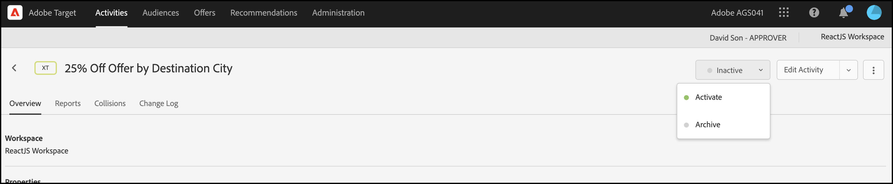

# 개인화 게재

## 단계 요약

1. 사용 [!UICONTROL 온디바이스 의사 결정] (조직)
1. 만들기 [!UICONTROL 경험 타기팅] (XT) 활동
1. 대상자별 개인화된 경험 정의
1. 대상자당 개인화된 경험 확인
1. 보고 설정
1. KPI 추적을 위한 지표 추가
1. 애플리케이션에서 개인화된 오퍼 구현
1. 전환 이벤트를 추적하는 코드 구현
1. 활성화 [!UICONTROL 경험 타기팅] (XT) 개인화 활동

당신이 여행사라고 가정해 보세요. 특정 여행 패키지를 25% 할인된 가격으로 맞춤형 오퍼를 제공하고자 합니다. 오퍼가 사용자에게 반향을 일으키도록 하려면 대상 도시의 랜드마크를 표시하기로 합니다. 또한 개인화된 오퍼의 게재가 거의 0에 가까운 지연 시간에 실행되어 사용자 경험에 부정적인 영향을 주지 않고 결과를 왜곡하려고 합니다.

## 1. 활성화 [!UICONTROL 온디바이스 의사 결정] (조직)

1. 온디바이스 의사 결정을 활성화하면 A/B 활동이 거의 0에 가까운 지연 시간에 실행됩니다. 이 기능을 사용하려면 다음 위치로 이동하십시오. **[!UICONTROL 관리]** > **[!UICONTROL 구현]** > **[!UICONTROL 계정 세부 정보]** 위치: [!DNL Adobe Target], 및 활성화 **[!UICONTROL 온디바이스 의사 결정]** 토글.

   

   >[!NOTE]
   >
   >관리자 또는 승인자가 있어야 합니다. [사용자 역할](https://experienceleague.adobe.com/docs/target/using/administer/manage-users/user-management.html) 을(를) 활성화 또는 비활성화하려면 [!UICONTROL 온디바이스 의사 결정] 토글.

   활성화 후 **[!UICONTROL 온디바이스 의사 결정]** 전환, [!DNL Adobe Target] 생성 시작 *규칙 아티팩트* 클라이언트.

## 2. 만들기 [!UICONTROL 경험 타기팅] (XT) 활동

1. 위치 [!DNL Adobe Target]로 이동한 다음 **[!UICONTROL 활동]** 페이지를 선택한 다음 **[!UICONTROL 활동 만들기]** > **[!UICONTROL 경험 타기팅]**.

   

1. 다음에서 **[!UICONTROL 경험 타깃팅 활동 만들기]** 모달, 기본값 유지 **[!UICONTROL 웹]** 옵션 선택됨 (1), 선택 **[!UICONTROL 양식]** 경험 작성기 (2)로서 작업 공간 및 속성 (3)을 선택하고 **[!UICONTROL 다음]** (4)

   

## 3. 대상자별로 개인화된 경험 정의

1. 다음에서 **[!UICONTROL 경험]** 활동 만들기 단계에서 **[!UICONTROL 대상 변경]** 이를 통해 캘리포니아 주 샌프란시스코로 여행하고자 하는 방문자를 대상으로 청중을 모집할 수 있습니다.

   

1. 다음에서 **[!UICONTROL 대상자 만들기]** 모달, 사용자 지정 규칙을 정의합니다. `destinationCity = San Francisco`. 이는 샌프란시스코로 이동하고자 하는 사용자 그룹을 정의합니다.

   

1. 아직 **[!UICONTROL 경험]** 단계, 골든 게이트 브리지에 대한 특별 오퍼를 렌더링하려는 응용 프로그램 내의 위치 이름 (1)을 입력합니다. 단, 샌프란시스코로 향하는 위치에 대해서만 가능합니다. 여기에 표시된 예에서 홈 페이지는 HTML 오퍼 (2)에 대해 선택한 위치이며, 다음에서 정의됩니다. **[!UICONTROL 콘텐츠]** 영역입니다.

   

1. 다음을 클릭하여 다른 타깃팅 대상 추가 **[!UICONTROL 경험 타깃팅 추가]**. 이번에는 대상 규칙을 정의하여 뉴욕으로 이동하려는 대상을 타겟팅합니다. `destinationCity = New York`. 응용 프로그램 내에서 엠파이어 스테이트 빌딩에 대한 특별 오퍼를 렌더링할 위치를 정의합니다. 여기에 표시된 예에서는 `homepage` 은 HTML 오퍼(2)에 대해 선택된 위치이며, 다음에서 정의됩니다. **[!UICONTROL 콘텐츠]** 영역입니다.

   

## 4. 대상자별로 개인화된 경험 확인

다음에서 **[!UICONTROL 타겟팅]** 단계에서는 대상자별로 원하는 개인화된 경험을 구성했는지 확인합니다.


## 5. 보고 설정

다음에서 **[!UICONTROL 목표 및 설정]** 단계, 선택 **[!UICONTROL Adobe Target]** (으)로 **[!UICONTROL 보고 소스]** 에서 활동 결과를 보려면 [!DNL Adobe Target] UI 또는 선택 **[!UICONTROL Adobe Analytics]** Adobe Analytics UI에서 이를 확인할 수 있습니다.


## 6. KPI 추적을 위한 지표 추가

선택 **[!UICONTROL 목표 지표]** 활동의 성공을 측정합니다. 이 예에서 성공적인 전환은 사용자가 개인화된 대상 오퍼를 클릭하는지 여부를 기반으로 합니다.

## 7. 애플리케이션에서 개인화된 오퍼 구현

>[!BEGINTABS]

>[!TAB Node.js]

```js {line-numbers="true"}
const TargetClient = require("@adobe/target-nodejs-sdk");

const CONFIG = {
  client: "acmeclient",
  organizationId: "1234567890@AdobeOrg"
};

const targetClient = TargetClient.create(CONFIG);

targetClient.getOffers({
  request: {      
    execute: {
      pageLoad: {
        parameters: {
          destinationCity: "San Francisco"
        }
      }
    }       
  }
})
.then(console.log)
.catch(console.error);
```

>[!TAB Java]

```java {line-numbers="true"}
ClientConfig config = ClientConfig.builder()
  .client("acmeclient")
  .organizationId("1234567890@AdobeOrg")
  .build();
TargetClient targetClient = TargetClient.create(config);

Context context = new Context().channel(ChannelType.WEB);

ExecuteRequest executeRequest = new ExecuteRequest();

RequestDetails pageLoad = new RequestDetails();
pageLoad.setParameters(
    new HashMap<String, String>() {
      {
        put("destinationCity", "San Francisco");
      }
    });

executeRequest.setPageLoad(pageLoad);

TargetDeliveryRequest request = TargetDeliveryRequest.builder()
  .context(context)
  .execute(executeRequest)
  .build();

TargetDeliveryResponse offers = targetClient.getOffers(request);
```

>[!ENDTABS]

## 8. 전환 이벤트를 추적하는 코드 구현

>[!BEGINTABS]

>[!TAB Node.js]

```js {line-numbers="true"}
//... Code removed for brevity

//When a conversion happens
TargetClient.sendNotifications({
    targetCookie,
    "request" : {
      "notifications" : [
        {
          type: "click",
          timestamp : Date.now(),
          id: "conversion",
          mbox : {
            name : "destinationOffer"
          }
        }
      ]
    }
})
```

>[!TAB Java]

```java {line-numbers="true"
ClientConfig config = ClientConfig.builder()
  .client("acmeclient")
  .organizationId("1234567890@AdobeOrg")
  .build();
TargetClient targetClient = TargetClient.create(config);

Context context = new Context().channel(ChannelType.WEB);

ExecuteRequest executeRequest = new ExecuteRequest();

RequestDetails pageLoad = new RequestDetails();
pageLoad.setParameters(
    new HashMap<String, String>() {
      {
        put("destinationCity", "San Francisco");
      }
    });

executeRequest.setPageLoad(pageLoad);
NotificationDeliveryService notificationDeliveryService = new NotificationDeliveryService();

Notification notification = new Notification();
notification.setId("conversion");
notification.setImpressionId(UUID.randomUUID().toString());
notification.setType(MetricType.CLICK);
notification.setTimestamp(System.currentTimeMillis());
notification.setTokens(
    Collections.singletonList(
        "IbG2Jz2xmHaqX7Ml/YRxRGqipfsIHvVzTQxHolz2IpSCnQ9Y9OaLL2gsdrWQTvE54PwSz67rmXWmSnkXpSSS2Q=="));

TargetDeliveryRequest targetDeliveryRequest =
    TargetDeliveryRequest.builder()
        .context(context)
        .execute(executeRequest)
        .notifications(Collections.singletonList(notification))
        .build();

TargetDeliveryResponse offers = targetClient.getOffers(request);
notificationDeliveryService.sendNotification(request);
```

>[!ENDTABS]

## 9. XT(경험 타깃팅) 활동을 활성화합니다


