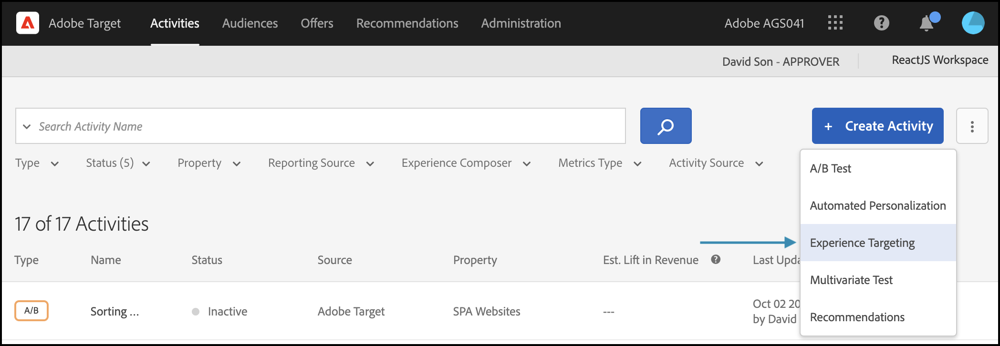
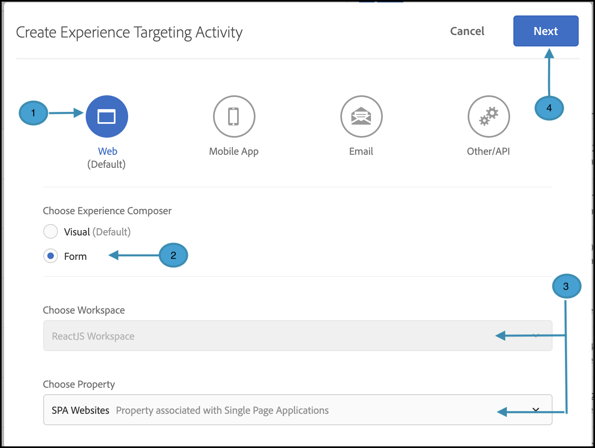
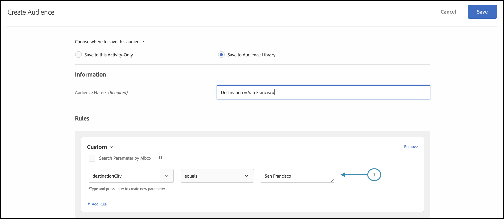

# 개인화 게재

## 단계 요약

1. 조직에 대해 [!UICONTROL on-device decisioning] 사용
1. [!UICONTROL Experience Targeting](XT) 활동 만들기
1. 대상자별 개인화된 경험 정의
1. 대상자당 개인화된 경험 확인
1. 보고 설정
1. KPI 추적을 위한 지표 추가
1. 애플리케이션에서 개인화된 오퍼 구현
1. 전환 이벤트를 추적하는 코드 구현
1. [!UICONTROL Experience Targeting](XT) 개인화 활동 활성화

당신이 여행사라고 가정해 보세요. 특정 여행 패키지를 25% 할인된 가격으로 맞춤형 오퍼를 제공하고자 합니다. 오퍼가 사용자에게 반향을 일으키도록 하려면 대상 도시의 랜드마크를 표시하기로 합니다. 또한 개인화된 오퍼의 게재가 거의 0에 가까운 지연 시간에 실행되어 사용자 경험에 부정적인 영향을 주지 않고 결과를 왜곡하려고 합니다.

## 1. 조직에 대해 [!UICONTROL on-device decisioning] 사용

1. 온디바이스 의사 결정을 활성화하면 A/B 활동이 거의 0에 가까운 지연 시간에 실행됩니다. 이 기능을 사용하려면 [!DNL Adobe Target]에서 **[!UICONTROL Administration]** > **[!UICONTROL Implementation]** > **[!UICONTROL Account details]**(으)로 이동하여 **[!UICONTROL On-Device Decisioning]** 전환을 사용하도록 설정하십시오.

   

   >[!NOTE]
   >
   >[!UICONTROL On-Device Decisioning] 전환을 활성화하거나 비활성화하려면 관리자 또는 승인자 [사용자 역할](https://experienceleague.adobe.com/docs/target/using/administer/manage-users/user-management.html)이(가) 있어야 합니다.

   **[!UICONTROL On-Device Decisioning]** 전환을 활성화한 후 [!DNL Adobe Target]에서 클라이언트에 대한 *규칙 아티팩트*&#x200B;를 생성하기 시작합니다.

## 2. [!UICONTROL Experience Targeting](XT) 활동 만들기

1. [!DNL Adobe Target]에서 **[!UICONTROL Activities]** 페이지로 이동한 다음 **[!UICONTROL Create Activity]** > **[!UICONTROL Experience Targeting]**&#x200B;을(를) 선택합니다.

   

1. **[!UICONTROL Create Experience Targeting Activity]** 모달에서 기본 **[!UICONTROL Web]** 옵션을 선택한 상태로 둡니다(1). **[!UICONTROL Form]**&#x200B;을(를) 경험 작성기로 선택합니다(2). 작업 공간 및 속성을 선택합니다(3). **[!UICONTROL Next]**(4)을(를) 클릭합니다.

   

## 3. 대상자별로 개인화된 경험 정의

1. **[!UICONTROL Experiences]** 활동 만들기 단계에서 **[!UICONTROL Change Audience]**&#x200B;을(를) 클릭하여 캘리포니아주 샌프란시스코로 여행하려는 방문자의 대상을 만듭니다.

   

1. **[!UICONTROL Create Audience]** 모달에서 `destinationCity = San Francisco`인 사용자 지정 규칙을 정의합니다. 이는 샌프란시스코로 이동하고자 하는 사용자 그룹을 정의합니다.

   

1. 여전히 **[!UICONTROL Experiences]** 단계에서는 골든 게이트 Bridge에 대한 특별 오퍼를 렌더링할 응용 프로그램 내 위치(1)의 이름을 입력합니다. 단, 샌프란시스코로 이동하는 경우에만 가능합니다. 여기에 표시된 예에서 홈 페이지는 **[!UICONTROL Content]** 영역에 정의된 HTML 오퍼 (2)에 대해 선택한 위치입니다.

   

1. **[!UICONTROL Add Experience Targeting]**&#x200B;을(를) 클릭하여 다른 타깃팅 대상을 추가합니다. 이번에는 `destinationCity = New York`인 대상 규칙을 정의하여 New York으로 이동하려는 대상을 타기팅합니다. 응용 프로그램 내에서 엠파이어 스테이트 빌딩에 대한 특별 오퍼를 렌더링할 위치를 정의합니다. 여기에 표시된 예에서 `homepage`은(는) **[!UICONTROL Content]** 영역에 정의된 HTML 오퍼(2)에 대해 선택한 위치입니다.

   

## 4. 대상자별로 개인화된 경험 확인

**[!UICONTROL Targeting]** 단계에서 대상자별로 원하는 개인화된 경험을 구성했는지 확인합니다.


## 5. 보고 설정

**[!UICONTROL Goals & Settings]** 단계에서 [!DNL Adobe Target] UI에서 활동 결과를 보려면 **[!UICONTROL Adobe Target]**&#x200B;을(를) **[!UICONTROL Reporting Source]**(으)로 선택하거나, Adobe Analytics UI에서 해당 결과를 보려면 **[!UICONTROL Adobe Analytics]**&#x200B;을(를) 선택하십시오.


## 6. KPI 추적을 위한 지표 추가

**[!UICONTROL Goal Metric]**&#x200B;을(를) 선택하여 활동의 성공을 측정합니다. 이 예에서 성공적인 전환은 사용자가 개인화된 대상 오퍼를 클릭하는지 여부를 기반으로 합니다.

## 7. 애플리케이션에서 개인화된 오퍼 구현

>[!BEGINTABS]

>[!TAB Node.js]

```js {line-numbers="true"}
const TargetClient = require("@adobe/target-nodejs-sdk");

const CONFIG = {
  client: "acmeclient",
  organizationId: "1234567890@AdobeOrg"
};

const targetClient = TargetClient.create(CONFIG);

targetClient.getOffers({
  request: {      
    execute: {
      pageLoad: {
        parameters: {
          destinationCity: "San Francisco"
        }
      }
    }       
  }
})
.then(console.log)
.catch(console.error);
```

>[!TAB Java]

```java {line-numbers="true"}
ClientConfig config = ClientConfig.builder()
  .client("acmeclient")
  .organizationId("1234567890@AdobeOrg")
  .build();
TargetClient targetClient = TargetClient.create(config);

Context context = new Context().channel(ChannelType.WEB);

ExecuteRequest executeRequest = new ExecuteRequest();

RequestDetails pageLoad = new RequestDetails();
pageLoad.setParameters(
    new HashMap<String, String>() {
      {
        put("destinationCity", "San Francisco");
      }
    });

executeRequest.setPageLoad(pageLoad);

TargetDeliveryRequest request = TargetDeliveryRequest.builder()
  .context(context)
  .execute(executeRequest)
  .build();

TargetDeliveryResponse offers = targetClient.getOffers(request);
```

>[!ENDTABS]

## 8. 전환 이벤트를 추적하는 코드 구현

>[!BEGINTABS]

>[!TAB Node.js]

```js {line-numbers="true"}
//... Code removed for brevity

//When a conversion happens
TargetClient.sendNotifications({
    targetCookie,
    "request" : {
      "notifications" : [
        {
          type: "click",
          timestamp : Date.now(),
          id: "conversion",
          mbox : {
            name : "destinationOffer"
          }
        }
      ]
    }
})
```

>[!TAB Java]

```java {line-numbers="true"
ClientConfig config = ClientConfig.builder()
  .client("acmeclient")
  .organizationId("1234567890@AdobeOrg")
  .build();
TargetClient targetClient = TargetClient.create(config);

Context context = new Context().channel(ChannelType.WEB);

ExecuteRequest executeRequest = new ExecuteRequest();

RequestDetails pageLoad = new RequestDetails();
pageLoad.setParameters(
    new HashMap<String, String>() {
      {
        put("destinationCity", "San Francisco");
      }
    });

executeRequest.setPageLoad(pageLoad);
NotificationDeliveryService notificationDeliveryService = new NotificationDeliveryService();

Notification notification = new Notification();
notification.setId("conversion");
notification.setImpressionId(UUID.randomUUID().toString());
notification.setType(MetricType.CLICK);
notification.setTimestamp(System.currentTimeMillis());
notification.setTokens(
    Collections.singletonList(
        "IbG2Jz2xmHaqX7Ml/YRxRGqipfsIHvVzTQxHolz2IpSCnQ9Y9OaLL2gsdrWQTvE54PwSz67rmXWmSnkXpSSS2Q=="));

TargetDeliveryRequest targetDeliveryRequest =
    TargetDeliveryRequest.builder()
        .context(context)
        .execute(executeRequest)
        .notifications(Collections.singletonList(notification))
        .build();

TargetDeliveryResponse offers = targetClient.getOffers(request);
notificationDeliveryService.sendNotification(request);
```

>[!ENDTABS]

## 9. XT(경험 타깃팅) 활동을 활성화합니다


