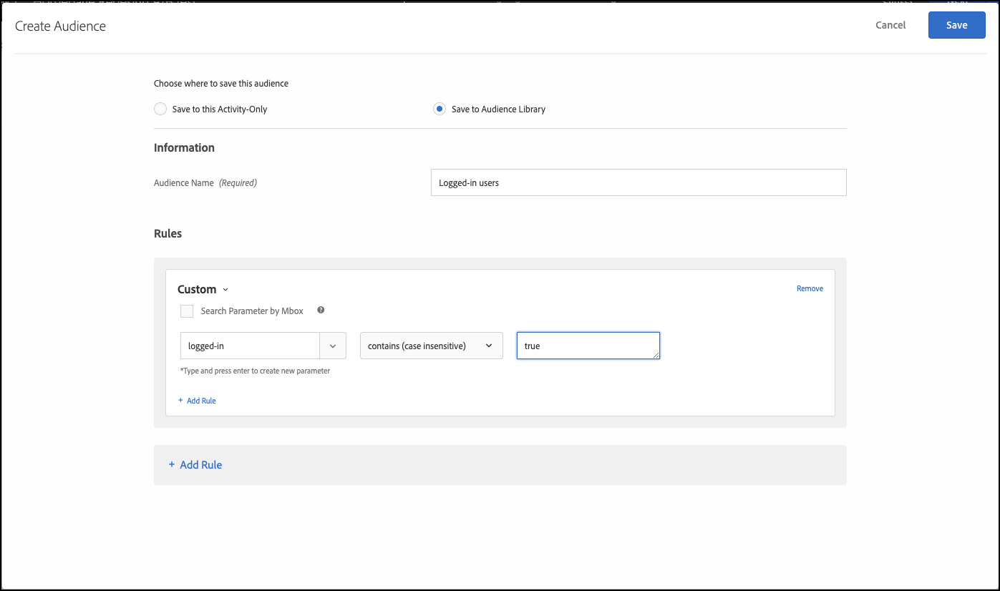

# 기능 플래그를 사용하여 A/B 테스트 실행

## 단계 요약

1. 조직에 대해 [!UICONTROL on-device decisioning] 사용
1. [!UICONTROL A/B Test] 활동 만들기
1. A 및 B 정의
1. 대상자 추가
1. 트래픽 할당 설정
1. 트래픽 분포를 변형으로 설정
1. 보고 설정
1. KPI 추적을 위한 지표 추가
1. 기능 플래그를 사용하여 A/B 테스트를 실행하는 코드 구현
1. 기능 플래그로 A/B 테스트 활성화

>[!NOTE]
>
>가을 테마 홈 페이지 재디자인이 사용자에게 잘 표시되는지 여부를 확인하려고 한다고 가정해 보겠습니다. [!DNL Adobe Target]에서 A/B 실험을 실행하여 테스트하기로 합니다. 또한 부정적 또는 느린 사용자 경험이 결과를 왜곡하지 않도록 실험이 우수한 성능으로 전달되는지 확인해야 합니다.

## 1. 조직에 대해 [!UICONTROL on-device decisioning] 사용

온디바이스 의사 결정을 활성화하면 A/B 활동이 거의 0에 가까운 지연 시간에 실행됩니다. 이 기능을 사용하려면 [!DNL Adobe Target]에서 **[!UICONTROL Administration]** > **[!UICONTROL Implementation]** > **[!UICONTROL Account details]**(으)로 이동하여 **[!UICONTROL On-Device Decisioning]** 전환을 사용하도록 설정하십시오.

&lt;!— image-odd4.png 삽입 —>


>[!NOTE]
>
>온디바이스 의사 결정 토글을 활성화하거나 비활성화하려면 관리자 또는 승인자 [사용자 역할](https://experienceleague.adobe.com/docs/target/using/administer/manage-users/user-management.html)이 있어야 합니다.

**[!UICONTROL On-Device Decisioning]** 전환을 활성화한 후 [!DNL Adobe Target]에서 클라이언트에 대한 규칙 아티팩트를 생성하기 시작합니다.

## 2. [!UICONTROL A/B Test] 활동 만들기

[!DNL Adobe Target]에서 **[!UICONTROL Activities]** 페이지로 이동한 다음 **[!UICONTROL Create Activity]** > **[!UICONTROL A/B test]**&#x200B;을(를) 선택합니다.


**[!UICONTROL Create A/B Test Activity]** 모달에서 기본 **[!UICONTROL Web]** 옵션을 선택한 상태로 둡니다(1). **[!UICONTROL Form]**&#x200B;을(를) 경험 작성기로 선택합니다(2). **[!UICONTROL Property Restrictions]**&#x200B;이(가) 없는 **[!UICONTROL Default Workspace]**(3)을(를) 선택하고 **[!UICONTROL Next]**(4)을(를) 클릭합니다.


## 3. A 및 B 정의

1. 활동을 만드는 **[!UICONTROL Experiences]** 단계에서 **[!UICONTROL Add Experience]**(2) 단추를 클릭하여 활동의 이름(1)을 입력하고 두 번째 경험인 경험 B를 추가합니다. A/B 테스트를 실행할 애플리케이션 내의 위치(3)의 이름을 입력합니다. 아래 표시된 예에서 홈 페이지는 경험 A에 대해 정의된 위치입니다(경험 B에 대해 정의된 위치이기도 함).

   경험 A는 현재 홈 페이지 디자인인 컨트롤을 정의합니다.

   

   경험 B는 새롭게 디자인된 홈페이지를 나타내는 챌린저를 정의합니다. 기본 콘텐츠(1)를 변경하려면 를 클릭합니다.

   

1. 경험 B에서 아래 (1)과 같이 **[!UICONTROL Create JSON Offer]**&#x200B;을(를) 선택하여 콘텐츠를 **[!UICONTROL Default Content]**&#x200B;에서 다시 디자인된 콘텐츠로 변경하려면 클릭합니다.

   

1. 비즈니스 로직이 프로덕션의 현재 홈 페이지가 아닌 새로 다시 디자인된 홈 페이지를 렌더링할 수 있도록 플래그로 활용할 속성으로 JSON을 정의합니다.


   >[!NOTE]
   >
   >[!DNL Adobe Target]이(가) 경험 B(다시 디자인된 홈 페이지)를 보기 위해 사용자를 버킷하면 예제에 정의된 특성이 있는 JSON이 반환됩니다. 코드에서는 속성 값을 확인하여 다시 디자인된 홈 페이지를 렌더링할 비즈니스 논리를 실행할지 여부를 결정해야 합니다. 이 JSON 응답에 이름, 값 및 속성 수를 정의하게 됩니다.

   

## 4. 대상자 추가

먼저 로그인 여부를 기반으로 식별할 수 있는 단골 고객에 대한 재설계를 테스트한다고 가정합니다.

1. **[!UICONTROL Targeting]** 단계에서 **[!UICONTROL All Visitors]** 대상자를 바꾸려면 을(를) 클릭합니다(표시된 대로).

   

1. **[!UICONTROL Create Audience]** 모달에서 `logged-in = true`인 사용자 지정 규칙을 정의합니다. 로그인한 사용자 그룹을 정의합니다. 활동에서 이 대상을 사용합니다.

   

## 5. 트래픽 할당 설정

새 홈 페이지 재디자인을 테스트할 로그인한 사용자의 비율을 정의합니다. 즉, 이 테스트를 롤아웃할 사용자의 비율은 얼마입니까? 이 예에서 이 테스트를 로그인한 모든 사용자에게 배포하려면 트래픽 할당을 100%로 유지합니다.


## 6. 트래픽 분포를 변형으로 설정

로그인된 사용자가 홈 페이지의 현재 디자인 또는 완전히 새로운 재디자인을 보게 되는 비율을 정의합니다. 이 예에서는 트래픽 분포를 경험 A와 B 간에 50/50으로 분할합니다.


## 7. 보고 설정

**[!UICONTROL Goals & Settings]** 단계에서 [!DNL Adobe Target] UI에서 활동 결과를 보려면 **[!UICONTROL Adobe Target]**&#x200B;을(를) **[!UICONTROL Reporting Source]**(으)로 선택하거나, Adobe Analytics UI에서 해당 결과를 보려면 **[!UICONTROL Adobe Analytics]**&#x200B;을(를) 선택하십시오.


## 8. KPI 추적을 위한 지표 추가

A/B 테스트를 측정할 **[!UICONTROL Goal Metric]**&#x200B;을(를) 선택하십시오. 이 예에서 성공적인 전환은 사용자가 페이지 하단에 도달하는지 여부를 기반으로 하여 참여를 나타냅니다. 따라서 **[!UICONTROL Conversion]**&#x200B;은(는) 사용자가 페이지 하단 위치를 보았는지 여부에 따라 결정됩니다.

## 9. 기능 플래그를 사용하여 A/B 테스트를 실행하는 코드를 애플리케이션에 구현합니다

>[!BEGINTABS]

>[!TAB Node.js]

```js {line-numbers="true"}
const TargetClient = require("@adobe/target-nodejs-sdk");
const options = {
  client: "testClient",
  organizationId: "ABCDEF012345677890ABCDEF0@AdobeOrg",
  decisioningMethod: "on-device",
  events: {
    clientReady: targetClientReady
  }
};
const targetClient = TargetClient.create(options);

function targetClientReady() {
  return targetClient.getAttributes(["homepage"]).then(function(attributes) {
    const flag = attributes.getValue("homepage", "feature-flag");
    // ...
  });
}
```

>[!TAB Java]

```java {line-numbers="true"}
import com.adobe.target.edge.client.ClientConfig;
import com.adobe.target.edge.client.TargetClient;
import com.adobe.target.delivery.v1.model.ChannelType;
import com.adobe.target.delivery.v1.model.Context;
import com.adobe.target.delivery.v1.model.ExecuteRequest;
import com.adobe.target.delivery.v1.model.MboxRequest;
import com.adobe.target.edge.client.entities.TargetDeliveryRequest;
import com.adobe.target.edge.client.model.TargetDeliveryResponse;

ClientConfig config = ClientConfig.builder()
    .client("testClient")
    .organizationId("ABCDEF012345677890ABCDEF0@AdobeOrg")
    .build();
TargetClient targetClient = TargetClient.create(config);
MboxRequest mbox = new MboxRequest().name("homepage").index(0);
TargetDeliveryRequest request = TargetDeliveryRequest.builder()
    .context(new Context().channel(ChannelType.WEB))
    .execute(new ExecuteRequest().mboxes(Arrays.asList(mbox)))
    .build();
Attributes attributes = targetClient.getAttributes(request, "homepage");
String flag = attributes.getString("homepage", "feature-flag");
```

>[!ENDTABS]

## 10. 기능 플래그로 A/B 테스트 활성화


