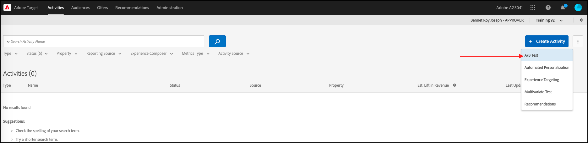

# 속성을 사용하여 기능 테스트 실행

## 단계 요약

1. 조직에 대해 [!UICONTROL on-device decisioning] 사용
1. [!UICONTROL A/B Test] 활동 만들기
1. A 및 B 정의
1. 대상자 추가
1. 트래픽 할당 설정
1. 트래픽 분포를 변형으로 설정
1. 보고 설정
1. KPI 추적을 위한 지표 추가
1. 속성을 사용하여 기능 테스트를 실행하는 코드 구현
1. 전환 이벤트를 추적하는 코드 구현
1. 속성을 사용하여 기능 테스트 활성화

>[!NOTE]
>
>소매 전자 상거래 회사라고 가정합니다. 고객이 제품 카탈로그를 검색하고 정렬할 때 전환율을 높이려고 합니다. 특정 정렬 알고리즘과 페이지 매김 전략이 다른 것보다 더 나은 결과를 얻는다는 가설이 있습니다. 이러한 이론을 테스트하기 위해 최종 사용자를 위한 다양한 정렬 옵션을 사용하여 정렬 위젯의 재설계와 관련된 기능 테스트를 실행하도록 결정합니다. 이 기능 테스트가 거의 0에 가까운 지연에서 실행되어 사용자 경험에 부정적인 영향을 주지 않고 결과를 왜곡하지 않도록 하려는 경우

## 1. 조직에 대해 [!UICONTROL on-device decisioning] 사용

온디바이스 의사 결정을 활성화하면 A/B 활동이 거의 0에 가까운 지연 시간에 실행됩니다. 이 기능을 사용하려면 [!DNL Adobe Target]에서 **[!UICONTROL Administration]** > **[!UICONTROL Implementation]** > **[!UICONTROL Account details]**(으)로 이동하여 **[!UICONTROL On-Device Decisioning]** 전환을 사용하도록 설정하십시오.


>[!NOTE]
>
>**[!UICONTROL On-Device Decisioning]** 전환을 활성화하거나 비활성화하려면 관리자 또는 승인자 [사용자 역할](https://experienceleague.adobe.com/docs/target/using/administer/manage-users/user-management.html?lang=ko)이(가) 있어야 합니다.

**[!UICONTROL On-Device Decisioning]** 전환을 활성화한 후 [!DNL Adobe Target]에서 클라이언트에 대한 *규칙 아티팩트*&#x200B;를 생성하기 시작합니다.

## 2. [!UICONTROL A/B Test] 활동 만들기

1. [!DNL Adobe Target]에서 **[!UICONTROL Activities]** 페이지로 이동한 다음 **[!UICONTROL Create Activity]** > **[!UICONTROL A/B test]**&#x200B;을(를) 선택합니다.

   

1. **[!UICONTROL Create A/B Test Activity]** 모달에서 기본 **[!UICONTROL Web]** 옵션을 선택한 상태로 둡니다(1). **[!UICONTROL Form]**&#x200B;을(를) 경험 작성기로 선택합니다(2). **[!UICONTROL No Property Restrictions]**(3)을(를) 사용하여 **[!UICONTROL Default Workspace]**&#x200B;을(를) 선택하고 **[!UICONTROL Next]**(4)을(를) 클릭합니다.

   

## 3. A 및 B 정의

1. 활동을 만드는 **[!UICONTROL Experiences]** 단계에서 **[!UICONTROL Add Experience]**(2) 단추를 클릭하여 활동의 이름(1)을 입력하고 두 번째 경험인 경험 B를 추가합니다. 속성을 사용하여 기능 테스트를 실행할 응용 프로그램 내의 위치(3)의 이름을 입력합니다. 아래 예제에서 `product-results-page`은(는) 경험 A에 대해 정의된 위치입니다. 또한 경험 B에 대해 정의된 위치입니다.

   

   **[!UICONTROL Experience A]**&#x200B;에는 비즈니스 논리에 다음과 같은 작업을 수행하도록 신호를 보내는 JSON이 포함됩니다.

   * `test_sorting` 기능 플래그를 통해 정렬 알고리즘 기능 시작
   * `sorting_algorithm _**_attribute`에 정의된 권장 정렬 알고리즘 실행
   * `pagination_limit`에 정의된 페이지 매김 전략에 정의된 대로 페이지당 50개의 제품을 반환합니다.

1. 경험 A에서 아래 (1)과 같이 **[!UICONTROL Create JSON Offer]**&#x200B;을(를) 선택하여 콘텐츠를 **[!UICONTROL Default Content]**&#x200B;에서 JSON으로 변경하려면 클릭합니다.

   

1. 페이지 매김 제한이 50개인 권장 정렬 알고리즘을 시작하는 데 사용할 `test_sorting`, `sorting_algorithm`, `pagination_limit` 플래그와 특성을 사용하여 JSON을 정의하십시오.

   >[!NOTE]
   >
   >[!DNL Adobe Target]이(가) 사용자를 버킷하여 경험 A를 보게 되면 예제에 정의된 특성이 있는 JSON이 반환됩니다. 코드에서 기능 플래그 `test_sorting`의 값을 검사하여 정렬 기능을 켜야 하는지 확인해야 합니다. 이 경우 `sorting_algorithm` 특성의 권장 값을 사용하여 제품 목록 보기에 권장 제품을 표시합니다. 응용 프로그램에 대해 표시할 제품의 한도는 50입니다. 이 값은 `pagination_limit` 특성의 값입니다.

   

   **[!UICONTROL Experience B]**&#x200B;은(는) 비즈니스 논리에 다음과 같은 작업을 수행하도록 신호를 보내는 JSON을 정의합니다.

   * test_sorting 기능 플래그를 통해 정렬 알고리즘 기능 시작
   * `sorting_algorithm _**_attribute`에 정의된 `best_sellers` 정렬 알고리즘을 실행합니다.
   * `pagination_limit`에 정의된 페이지 매김 전략에 정의된 대로 페이지당 50개의 제품을 반환합니다.

   >[!NOTE]
   >
   >[!DNL Adobe Target]이(가) 사용자를 버킷하여 경험 B를 보게 되면 예제에 정의된 특성이 있는 JSON이 반환됩니다. 코드에서 기능 플래그 `test_sorting`의 값을 검사하여 정렬 기능을 켜야 하는지 확인해야 합니다. 그럴 경우 `sorting_algorithm` 특성의 `best_sellers` 값을 사용하여 제품 목록 보기에서 베스트셀러 제품을 표시합니다. 응용 프로그램에 대해 표시할 제품의 한도는 50입니다. 이 값은 `pagination_limit` 특성의 값입니다.

   

## 4. 대상자 추가

**[!UICONTROL Targeting]** 단계에서 **[!UICONTROL All Visitors]** 대상을 유지합니다. 이렇게 하면 정렬 기능의 영향과 결과에 가장 큰 영향을 미치는 알고리즘 및 항목 수를 이해할 수 있습니다.


## 5. 트래픽 할당 설정

정렬 알고리즘 및 페이지 매김 전략을 테스트할 방문자의 비율을 정의합니다. 즉, 이 테스트를 롤아웃할 사용자의 비율은 얼마입니까? 이 예에서 이 테스트를 로그인한 모든 사용자에게 배포하려면 트래픽 할당을 100%로 유지합니다.


## 6. 트래픽 분포를 변형으로 설정

페이지당 50개 제품 제한으로 권장 대 베스트셀러 정렬 알고리즘을 보게 되는 방문자의 비율을 정의합니다. 이 예에서는 트래픽 분포를 경험 A와 B 간에 50/50으로 분할합니다.


## 7. 보고 설정

**[!UICONTROL Goals & Settings]** 단계에서 A/B 테스트 결과를 [!DNL Adobe Target] UI에서 보려면 **[!UICONTROL Adobe Target]**&#x200B;을(를) **[!UICONTROL Reporting Source]**(으)로 선택하거나, Adobe Analytics UI에서 보려면 **[!UICONTROL Adobe Analytics]**&#x200B;을(를) 선택하십시오.


## 8. KPI 추적을 위한 지표 추가

특성을 사용하여 기능 테스트를 측정하려면 **[!UICONTROL Goal Metric]**&#x200B;을(를) 선택하십시오. 이 예에서 성공은 표시된 정렬 알고리즘 및 페이지 매김 전략에 따라 사용자가 제품을 구매하는지 여부에 따라 결정됩니다.

## 9. 속성을 사용하여 기능 테스트를 애플리케이션에 구현합니다

>[!BEGINTABS]

>[!TAB Node.js]

```js {line-numbers="true"}
const TargetClient = require("@adobe/target-nodejs-sdk");
const options = {
  client: "testClient",
  organizationId: "ABCDEF012345677890ABCDEF0@AdobeOrg",
  decisioningMethod: "on-device",
  events: {
    clientReady: targetClientReady
  }
};
const targetClient = TargetClient.create(options);

function targetClientReady() {
  return targetClient.getAttributes(["product-results-page"]).then(function(attributes) {
    const test_sorting = attributes.getValue("product-results-page", "test-sorting");
    const sorting_algorithm = attributes.getValue("product-results-page", "sorting_algorithm");
    const pagination_limit = attributes.getValue("product-results-page", "pagination_limit");
  });
}
```

>[!TAB Java]

```java {line-numbers="true"}
import com.adobe.target.edge.client.ClientConfig;
import com.adobe.target.edge.client.TargetClient;
import com.adobe.target.delivery.v1.model.ChannelType;
import com.adobe.target.delivery.v1.model.Context;
import com.adobe.target.delivery.v1.model.ExecuteRequest;
import com.adobe.target.delivery.v1.model.MboxRequest;
import com.adobe.target.edge.client.entities.TargetDeliveryRequest;
import com.adobe.target.edge.client.model.TargetDeliveryResponse;

ClientConfig config = ClientConfig.builder()
    .client("testClient")
    .organizationId("ABCDEF012345677890ABCDEF0@AdobeOrg")
    .build();
TargetClient targetClient = TargetClient.create(config);
MboxRequest mbox = new MboxRequest().name("product-results-page").index(0);
TargetDeliveryRequest request = TargetDeliveryRequest.builder()
    .context(new Context().channel(ChannelType.WEB))
    .execute(new ExecuteRequest().mboxes(Arrays.asList(mbox)))
    .build();
Attributes attributes = targetClient.getAttributes(request, "product-results-page");
String testSorting = attributes.getString("product-results-page", "test-sorting");
String sortingAlgorithm = attributes.getString("product-results-page", "sorting_algorithm");
String paginationLimit = attributes.getString("product-results-page", "pagination_limit");
```

>[!ENDTABS]

## 10. 전환 이벤트를 추적하는 코드 구현

>[!BEGINTABS]

>[!TAB Node.js]

```js {line-numbers="true"}
//... Code removed for brevity

//When a conversion happens
TargetClient.sendNotifications({
    targetCookie,
    "request" : {
      "notifications" : [
        {
          type: "click",
          timestamp : Date.now(),
          id: "conversion",
          mbox : {
            name : "product-results-page"
          }
        }
      ]
    }
})
```

>[!TAB Java]

```java {line-numbers="true"}
ClientConfig config = ClientConfig.builder()
  .client("acmeclient")
  .organizationId("1234567890@AdobeOrg")
  .build();
TargetClient targetClient = TargetClient.create(config);

Context context = new Context().channel(ChannelType.WEB);

ExecuteRequest executeRequest = new ExecuteRequest();

NotificationDeliveryService notificationDeliveryService = new NotificationDeliveryService();

Notification notification = new Notification();
notification.setId("conversion");
notification.setImpressionId(UUID.randomUUID().toString());
notification.setType(MetricType.CLICK);
notification.setTimestamp(System.currentTimeMillis());
notification.setTokens(
    Collections.singletonList(
        "IbG2Jz2xmHaqX7Ml/YRxRGqipfsIHvVzTQxHolz2IpSCnQ9Y9OaLL2gsdrWQTvE54PwSz67rmXWmSnkXpSSS2Q=="));

TargetDeliveryRequest targetDeliveryRequest =
    TargetDeliveryRequest.builder()
        .context(context)
        .execute(executeRequest)
        .notifications(Collections.singletonList(notification))
        .build();

TargetDeliveryResponse offers = targetClient.getOffers(request);
notificationDeliveryService.sendNotification(request);

Attributes attributes = targetClient.getAttributes(request, "product-results-page");
String testSorting = attributes.getString("product-results-page", "test-sorting");
String sortingAlgorithm = attributes.getString("product-results-page", "sorting_algorithm");
String paginationLimit = attributes.getString("product-results-page", "pagination_limit");
```

>[!ENDTABS]

## 11. 속성을 사용하여 기능 테스트 활성화


