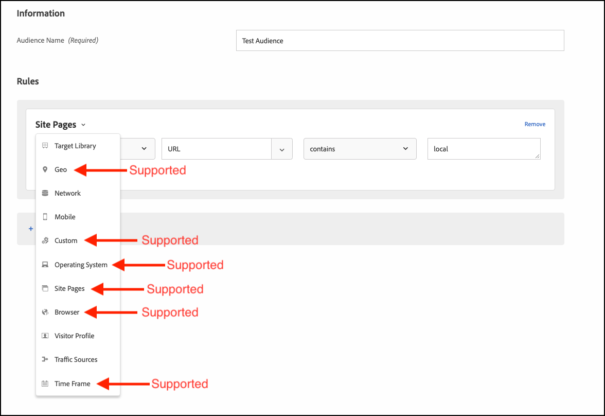

# 문제 해결 [!UICONTROL 온디바이스 의사 결정]

## 구성 확인

### 단계 요약

1. 다음을 확인합니다. `logger` 이(가) 구성됨
1. 확인 [!DNL Target] 추적이 활성화되었습니다.
1. 확인 [!UICONTROL 온디바이스 의사 결정] *규칙 아티팩트* 정의된 폴링 간격에 따라 검색하고 캐시했습니다.
1. 테스트를 만들어 캐시된 규칙 아티팩트를 통해 컨텐츠 전달의 유효성 검사 [!UICONTROL 온디바이스 의사 결정] 양식 기반 경험 작성기를 통한 활동.
1. Inspect 알림 전송 오류

## 1. 로거가 구성되어 있는지 확인합니다

SDK를 초기화할 때 로깅을 활성화했는지 확인하십시오.

**Node.js**

Node.js SDK의 경우 `logger` 개체를 제공해야 합니다.

```js {line-numbers="true"}
const CONFIG = {
  client: "<your client code>",
  organizationId: "<your organization ID>",
  logger: console
};
```

**Java SDK**

Java SDK용 `logRequests` 다음에 있음 `ClientConfig` 을 활성화해야 합니다.

```js {line-numbers="true"}
ClientConfig config = ClientConfig.builder()
  .client("<your client code>")
  .organizationId("<your organization ID>")
  .logRequests(true)
  .build();
```

또한 JVM은 다음 명령줄 매개 변수로 시작해야 합니다.

```bash {line-numbers="true"}
java -Dorg.slf4j.simpleLogger.defaultLogLevel=DEBUG ...
```

## 2. 다음을 확인합니다[!DNL Target]추적 활성화됨

추적을 활성화하면에서 추가 정보를 출력합니다. [!DNL Adobe Target] 규칙 아티팩트에 관해서입니다.

1. 다음 위치로 이동[!DNL Target]의 UI [!DNL Experience Cloud].

   

1. 다음으로 이동 **[!UICONTROL 관리]** > **[!UICONTROL 구현]** 및 클릭 **[!UICONTROL 새 인증 토큰 생성]**.

   

1. 새로 생성된 인증 토큰을 클립보드에 복사한 다음 추가합니다.[!DNL Target]요청:

   **Node.js**

   ```js {line-numbers="true"}
   const request = {
     trace: {
       authorizationToken: "88f1a924-6bc5-4836-8560-2f9c86aeb36b"
     },
     execute: {
       mboxes: [{
         name: "sdk-mbox"
       }]
   }};
   ```

   **Java**

   ```js {line-numbers="true"}
   Trace trace = new Trace()
     .authorizationToken("88f1a924-6bc5-4836-8560-2f9c86aeb36b");
   Context context = new Context()
     .channel(ChannelType.WEB);
   MboxRequest mbox = new MboxRequest()
     .name("sdk-mbox")
     .index(0);
   ExecuteRequest executeRequest = new ExecuteRequest()
     .mboxes(Arrays.asList(mbox));
   
   TargetDeliveryRequest request = TargetDeliveryRequest.builder()
     .trace(trace)
     .context(context)
     .execute(executeRequest)
     .build();
   ```

1. 로거 및 추적을 적절히 사용하여 앱을 시작하고 서버 터미널을 모니터링합니다. 로거의 다음 출력에서 규칙 아티팩트가 검색되었음을 확인합니다.

   **Node.js SDK**

   ```text {line-numbers="true"}
     AT: LD.ArtifactProvider fetching artifact - https://assets.adobetarget.com/your-client-code/production/v1/rules.json
     AT: LD.ArtifactProvider artifact received - status=200
   ```

## 3. 다음을 확인합니다 [!UICONTROL 온디바이스 의사 결정] *규칙 아티팩트* 정의된 폴링 간격에 따라 검색하고 캐시했습니다.

1. 폴링 간격(기본값: 5분) 기간을 기다린 후 SDK에서 아티팩트를 가져오는지 확인하십시오. 동일한 터미널 로그가 출력됩니다.

   또한[!DNL Target]규칙 아티팩트에 대한 세부 정보와 함께 추적을 터미널에 출력해야 합니다.

   ```text {line-numbers="true"}
   "trace": {
     "clientCode": "your-client-code",
     "artifact": {
       "artifactLocation": "https://assets.adobetarget.com/your-client-code/production/v1/rules.json",
       "pollingInterval": 300000,
       "pollingHalted": false,
       "artifactVersion": "1.0.0",
       "artifactRetrievalCount": 10,
       "artifactLastRetrieved": "2020-09-20T00:09:42.707Z",
       "clientCode": "your-client-code",
       "environment": "production",
       "generatedAt": "2020-09-22T17:17:59.783Z"
     },
   ```

## 4. 테스트를 만들어 캐시된 규칙 아티팩트를 통해 컨텐츠 전달의 유효성을 검사합니다 [!UICONTROL 온디바이스 의사 결정] 양식 기반 경험 작성기를 통한 활동

1. 다음 위치로 이동[!DNL Target]Experience Cloud의 UI

   

1. 양식 기반 경험 작성기를 사용하여 새 XT 활동을 만듭니다.

   

1. 에 사용된 mbox 이름 입력[!DNL Target]xt 활동의 위치로 요청합니다(이는 개발 목적상 특히 고유한 mbox 이름이어야 함).

   

1. 콘텐츠를 HTML 오퍼 또는 JSON 오퍼로 변경합니다. 이 은(는)[!DNL Target]애플리케이션에 요청합니다. 활동에 대한 타깃팅을 &#39;모든 방문자&#39;로 두고 원하는 지표를 선택합니다. 활동의 이름을 지정하고, 저장한 다음 활성화하여 사용 중인 mbox/위치가 개발용으로만 사용되도록 합니다.

   

1. 애플리케이션에서 응답의 응답으로 받은 콘텐츠에 대한 로그 구문을 추가합니다.[!DNL Target]요청

   **Node.js SDK**

   ```js {line-numbers="true"}
   try {
     const response = await targetClient.getOffers({ request });
     console.log('Response: ', response.response.execute.mboxes[0].options[0].content);
   } catch (error) {
     console.error('Something went wrong', error);
   }
   ```

   **Java SDK**

   ```js {line-numbers="true"}
   try {
     Context context = new Context()
       .channel(ChannelType.WEB);
     MboxRequest mbox = new MboxRequest()
       .name("sdk-mbox")
       .index(0);
     ExecuteRequest executeRequest = new ExecuteRequest()
       .mboxes(Arrays.asList(mbox));
   
     TargetDeliveryRequest request = TargetDeliveryRequest.builder()
       .context(context)
       .decisioningMethod(DecisioningMethod.ON_DEVICE)
       .execute(executeRequest)
       .build();
   
       TargetDeliveryResponse response = targetClient.getOffers(request);
     logger.debug("Response: ", response.getResponse().getExecute().getMboxes().get(0).getOptions().get(0).getContent());
   } catch (Exception exception) {
     logger.error("Something went wrong", exception);
   }
   ```

1. 터미널의 로그를 검토하여 콘텐츠가 게재되고 있는지, 그리고 콘텐츠가 서버의 규칙 아티팩트를 통해 게재되었는지 확인합니다. 다음 `LD.DeciscionProvider` 객체는 활동 자격 및 의사 결정이 규칙 아티팩트를 기반으로 디바이스에서 결정되면 출력됩니다. 또한 의 로깅으로 인해 `content`, 다음이 표시됩니다. `<div>test</div>` 또는 테스트 활동을 만들 때 응답이 가 되도록 결정했습니다.

   **로거 출력**

   ```text {line-numbers="true"}
   AT: LD.DecisionProvider {...}
   AT: Response received {...}
   Response:  <div>test</div>
   ```

## Inspect 알림 전송 오류

온디바이스 의사 결정을 사용할 때 getOffers 실행 요청에 대해 알림이 자동으로 전송됩니다. 이러한 요청은 백그라운드에서 자동으로 전송됩니다. 라는 이벤트를 구독하면 모든 오류를 검사할 수 있습니다. `sendNotificationError`. 다음은 Node.js SDK를 사용하여 알림 오류에 가입하는 방법을 보여 주는 코드 샘플입니다.

```js {line-numbers="true"}
const TargetClient = require("@adobe/target-nodejs-sdk");
let client;

function onSendNotificationError({ notification, error }) {
  console.log(
    `There was an error when sending a notification: ${error.message}`
  );
  console.log(`Notification Payload: ${JSON.stringify(notification, null, 2)}`);
}

async function targetClientReady() {
  const request = {
    context: { channel: "web" },
    execute: {
      mboxes: [{
        name: "a1-serverside-ab",
        index: 1
      }]
    }
  };
  const targetResponse = await client.getOffers({ request });
}

client = TargetClient.create({
  events: {
    clientReady: targetClientReady,
    sendNotificationError: onSendNotificationError
  }
});
```

## 일반적인 문제 해결 시나리오

반드시 검토하십시오. [지원되는 기능](supported-features.md) 대상 [!UICONTROL 온디바이스 의사 결정] 문제가 발생하는 경우.

### 지원되지 않는 대상 또는 활동으로 인해 온디바이스 의사 결정 활동이 실행되지 않음

발생할 수 있는 일반적인 문제는 다음과 같습니다. [!UICONTROL 온디바이스 의사 결정] 대상이 사용 중이거나 활동 유형이 지원되지 않아 활동이 실행되지 않습니다.

(1) 로거 출력을 사용하여 응답 개체에 있는 추적 속성의 항목을 검토합니다. 특히 캠페인 속성을 식별합니다.

**추적 출력**

```text {line-numbers="true"}
  "execute": {
  "mboxes": [
    {
      "name": "your-mbox-name",
      "index": 0,
      "trace": {
        "clientCode": "your-client-code",
        ...
        "campaigns": [],
        ...
      }
    }
```

자격을 부여하려는 활동이 다음 내에 없는 것을 알 수 있습니다. `campaigns` 대상 또는 활동 유형이 지원되지 않으므로 속성입니다. 활동이 아래에 나열되는 경우 `campaigns` 속성, 지원되지 않는 대상자 또는 활동 유형으로 인해 문제가 발생하지 않습니다.

(2) 또한 `rules.json` 파일 검색 결과 `trace` > `artifact` > `artifactLocation` 로거 출력에서 활동이 다음에서 누락되었음을 확인합니다. `rules` > `mboxes` 속성:

**로거 출력**

```text {line-numbers="true"}
 ...
 rules: {
   mboxes: { },
   views: { }
 }
```

마지막으로[!DNL Target]UI를 만들고 해당 활동을 찾습니다. [experience.adobe.com/target](https://experience.adobe.com/target)

대상자에서 사용된 규칙을 검토하고 지원되는 앞서 언급한 규칙만 사용하는지 확인하십시오. 또한 활동 유형이 A/B 또는 XT인지 확인합니다.



### 부적격 대상자로 인해 온디바이스 의사 결정 활동이 실행되지 않음

온디바이스 의사 결정 활동이 실행되고 있지 않지만 rules.json 파일에 활동이 포함되어 있는지 확인한 경우 다음 단계를 수행하십시오.

(1) 애플리케이션에서 실행 중인 mbox가 활동이 사용 중인 mbox와 동일한지 확인합니다.

>[!BEGINTABS]

>[!TAB rule.json]

```text {line-numbers="true"}
 ...
 rules: {
   mboxes: {
    target-only-node-sdk-mbox: [{ // this mbox name must match the mbox in your request
      ...
    }]
   }
 ...
```

>[!TAB Node.js SDK]

```js {line-numbers="true"}
 const request = {
   trace: {
     authorizationToken: '2dfc1dce-1e58-4e05-bbd6-a6725893d4d6'
   },
   execute: {
     mboxes: [{
       address: getAddress(req),
       name: "target-only-node-sdk-mbox-two" // this mbox name must match the mbox the activity is using
     }]
   }};
```

>[!TAB Java SDK]

```js {line-numbers="true"}
Context context = new Context()
  .channel(ChannelType.WEB);
MboxRequest mbox = new MboxRequest()
  .name("target-only-node-sdk-mbox-two")
  .index(0);
ExecuteRequest executeRequest = new ExecuteRequest()
  .mboxes(Arrays.asList(mbox));

TargetDeliveryRequest request = TargetDeliveryRequest.builder()
  .context(context)
  .decisioningMethod(DecisioningMethod.ON_DEVICE)
  .execute(executeRequest)
  .build();

TargetDeliveryResponse response = targetClient.getOffers(request);
```

>[!ENDTABS]

(2) 다음을 검토하여 활동에 대한 대상에 대해 자격이 있는지 확인합니다. `matchedRuleConditions` 또는 `unmatchedRuleConditions` 추적 출력의 속성:

**추적 출력**

```text {line-numbers="true"}
...
},
"campaignId": 368564,
"campaignType": "landing",
"matchedSegmentIds": [],
"unmatchedSegmentIds": [
  6188838
      ],
      "matchedRuleConditions": [],
          "unmatchedRuleConditions": [
            {
              "in": [
                "true",
                {
                  "var": "mbox.auth_lc"
                }
              ]
            }
          ]
    ...
```

일치하지 않는 규칙 조건이 있는 경우 활동에 대한 자격이 없으므로 활동이 실행되지 않습니다. 대상의 규칙을 검토하여 자격이 없는 이유를 확인하십시오.

### 온디바이스 의사 결정 활동이 실행되지 않지만 원인이 명확하지 않음

온디바이스 의사 결정 활동이 실행되지 않는 이유는 명확하지 않을 수 있습니다. 이 경우 다음 문제 해결 단계를 따라 문제를 식별하십시오.

(1) 콘솔에서 로거 추적 출력을 읽고 다음과 유사한 아티팩트 속성을 식별합니다.

**추적 출력**

```text {line-numbers="true"}
...
      "artifact": {
          "artifactLocation": "https://assets.adobetarget.com/your-client-code/production/v1/rules.json",
          "pollingInterval": 300000,
          "pollingHalted": false,
          "artifactVersion": "1.0.0",
          "artifactRetrievalCount": 3,
          "artifactLastRetrieved": "2020-10-16T00:56:27.596Z",
          "clientCode": "adobeinterikleisch",
          "environment": "production"
        },
...
```

다음을 살펴보십시오. `artifactLastRetrieved` 아티팩트 날짜 및 최신 항목이 있는지 확인합니다. `rules.json` 파일이 앱에 다운로드되었습니다.

(2) 다음을 찾습니다. `evaluatedCampaignTargets` 로거 출력의 속성:

**로거 출력**

```text {line-numbers="true"}
...
  "evaluatedCampaignTargets": [
      {
        "context": {
          "current_timestamp": 1602812599608,
          "current_time": "0143",
          "current_day": 5,
          "user": {
            "browserType": "unknown",
            "platform": "Unknown",
            "locale": "en",
            "browserVersion": -1
          },
          "page": {
            "url": "localhost:3000/",
            "path": "/",
            "query": "",
            "fragment": "",
            "subdomain": "",
            "domain": "3000",
            "topLevelDomain": "",
            "url_lc": "localhost:3000/",
            "path_lc": "/",
            "query_lc": "",
            "fragment_lc": "",
            "subdomain_lc": "",
            "domain_lc": "3000",
            "topLevelDomain_lc": ""
          },
          "referring": {
            "url": "localhost:3000/",
            "path": "/",
            "query": "",
            "fragment": "",
            "subdomain": "",
            "domain": "3000",
            "topLevelDomain": "",
            "url_lc": "localhost:3000/",
            "path_lc": "/",
            "query_lc": "",
            "fragment_lc": "",
            "subdomain_lc": "",
            "domain_lc": "3000",
            "topLevelDomain_lc": ""
          },
          "geo": {},
          "mbox": {},
          "allocation": 23.79
        },
        "campaignId": 368564,
        "campaignType": "landing",
        "matchedSegmentIds": [],
        "unmatchedSegmentIds": [
          6188838
        ],
        "matchedRuleConditions": [],
        "unmatchedRuleConditions": [
          {
            "in": [
              "true",
              {
                "var": "mbox.auth_lc"
              }
            ]
          }
        ]
...
```

(3) 검토 `context`, `page`, 및 `referring` 예상대로 되도록 하는 데이터가 활동의 타겟팅 자격에 영향을 줄 수 있습니다.

(4) 검토 `campaignId` 를 사용하여 실행할 활동을 평가합니다. 다음 `campaignId` 은(는) 의 활동 개요 탭에서 활동 ID와 일치합니다.[!DNL Target]UI:


(5) 검토 `matchedRuleConditions` 및 `unmatchedRuleConditions` 특정 활동의 대상 규칙에 대한 자격 조건을 충족할 수 없는 문제를 파악할 수 있습니다.

(6) 최신 항목 검토 `rules.json` 로컬에서 실행할 활동을 포함하기 위한 파일입니다. 위치는 1단계에서 위에 참조됩니다.

(7) 요청 및 활동에서 동일한 mbox 이름을 사용하고 있는지 확인합니다.

(8) 지원되는 대상 규칙 및 지원되는 활동 유형을 사용하고 있는지 확인합니다.

### mbox의 활동 설정에 다음에서 &quot;온디바이스 의사 결정 적격&quot;이 표시되어 있어도 서버 호출이 수행됩니다.[!DNL Target]사용자 인터페이스

장치가 온디바이스 의사 결정에 적합함에도 불구하고 서버 호출이 수행되는 몇 가지 이유는 다음과 같습니다.

* &quot;온디바이스 의사 결정 적격&quot; 활동에 사용된 mbox가 &quot;온디바이스 의사 결정 적격&quot;이 아닌 다른 활동에도 사용되는 경우 mbox는 `remoteMboxes` 의 섹션 `rules.json` 아티팩트. mbox가 아래에 나열된 경우 `remoteMboxes`, 임의 `getOffer(s)` 해당 mbox를 호출하면 서버가 호출됩니다.

* 작업 영역/속성에서 활동을 설정하고 SDK를 구성할 때 이를 포함하지 않는 경우 다음과 같은 문제가 발생할 수 있습니다. `rules.josn` 다운로드할 기본 작업 영역, `remoteMboxes` 섹션.
